# Avy ERP — Visitor Management Module
## Comprehensive Sub-PRD & Configuration Reference

> **Document Code:** AVY-VMS-PRD-001  
> **Module:** Visitor Management System (VMS)  
> **Audience:** Product Team, Engineering, Company Admins, Security Personnel  
> **Version:** 1.0  
> **Date:** March 2026  
> **Product:** Avy ERP (Avyren Technologies)  
> **Status:** Draft · Confidential

---

## Table of Contents

1. [Executive Summary](#1-executive-summary)
2. [Module Vision & Goals](#2-module-vision--goals)
3. [Module Scope & Sub-Modules](#3-module-scope--sub-modules)
4. [Visitor Lifecycle — End-to-End Flow](#4-visitor-lifecycle--end-to-end-flow)
5. [User Personas & Role-Based Access](#5-user-personas--role-based-access)
6. [Visitor Types & Classification](#6-visitor-types--classification)
7. [Pre-Registration & Invitation Workflow](#7-pre-registration--invitation-workflow)
8. [Self-Registration — QR Code Flow](#8-self-registration--qr-code-flow)
9. [Walk-In Visitor Flow](#9-walk-in-visitor-flow)
10. [Check-In Process & Gate Operations](#10-check-in-process--gate-operations)
11. [Visitor Badge & Identification](#11-visitor-badge--identification)
12. [Safety Induction & Compliance at Check-In](#12-safety-induction--compliance-at-check-in)
13. [Host Notification & Approval Engine](#13-host-notification--approval-engine)
14. [Visitor Tracking & On-Site Monitoring](#14-visitor-tracking--on-site-monitoring)
15. [Check-Out Process](#15-check-out-process)
16. [Today's Visitors Dashboard](#16-todays-visitors-dashboard)
17. [Visit History & Audit Trail](#17-visit-history--audit-trail)
18. [Visitor Watchlist & Blocklist](#18-visitor-watchlist--blocklist)
19. [Multi-Gate & Multi-Plant Support](#19-multi-gate--multi-plant-support)
20. [Emergency Evacuation & Muster Management](#20-emergency-evacuation--muster-management)
21. [Contractor & Vendor Visit Management](#21-contractor--vendor-visit-management)
22. [Group Visit & Event Management](#22-group-visit--event-management)
23. [Recurring Visitor & Frequent Visitor Pass](#23-recurring-visitor--frequent-visitor-pass)
24. [Vehicle & Material Gate Pass](#24-vehicle--material-gate-pass)
25. [Notification & Communication Configuration](#25-notification--communication-configuration)
26. [Data Fields — Complete Field Reference](#26-data-fields--complete-field-reference)
27. [Number Series Configuration for VMS](#27-number-series-configuration-for-vms)
28. [Reports & Analytics](#28-reports--analytics)
29. [Integration with Other Avy ERP Modules](#29-integration-with-other-avy-erp-modules)
30. [Data Privacy, Retention & Compliance](#30-data-privacy-retention--compliance)
31. [Configuration & System Settings](#31-configuration--system-settings)
32. [Mobile App — Visitor Management Features](#32-mobile-app--visitor-management-features)
33. [Kiosk Mode — Self-Service Terminal](#33-kiosk-mode--self-service-terminal)
34. [Web Portal — Visitor Self-Service](#34-web-portal--visitor-self-service)
35. [Offline Capability](#35-offline-capability)
36. [VMS Go-Live Readiness Checklist](#36-vms-go-live-readiness-checklist)
37. [Glossary](#37-glossary)

---

## 1. Executive Summary

The Visitor Management Module in Avy ERP is a comprehensive, digitally-native system designed to replace outdated paper-based visitor logbooks with an intelligent, secure, and auditable platform. It manages the complete lifecycle of every external person who enters a company's premises — from the moment a visit is planned to the moment the visitor exits the facility.

Built specifically for **manufacturing enterprises and industrial facilities** — Avy ERP's primary audience — this module goes beyond simple check-in/check-out. It enforces **safety inductions**, captures **PPE acknowledgements**, manages **contractor compliance**, integrates with **gate security operations**, and maintains a **real-time headcount** for emergency evacuations.

The module is tightly integrated with the **Security Module** (which acts as the gate-level operational layer), the **HR Module** (for host employee verification and attendance cross-referencing), and the **Vendor Management Module** (for vendor and contractor visit tracking).

Every visitor interaction — pre-registration, check-in, badge issuance, safety briefing acknowledgement, host approval, check-out — is digitally logged with timestamps, creating a tamper-proof audit trail that supports regulatory compliance (OSHA, ISO, Factories Act, and company-specific policies).

---

## 2. Module Vision & Goals

### 2.1 Vision Statement

> Every person who enters our facility is identified, informed, and accounted for — from the moment they are invited to the moment they leave. No exceptions. No paper. No guesswork.

### 2.2 Module Goals

| Goal | Description |
|---|---|
| **Security First** | Ensure only authorised, verified visitors gain access to the facility. Block flagged individuals automatically. |
| **Safety Compliance** | Every visitor acknowledges safety protocols and PPE requirements before entering the shop floor or production areas. |
| **Speed** | Pre-registered visitors should clear the gate in under 60 seconds. Walk-ins should complete full check-in in under 3 minutes. |
| **Real-Time Visibility** | At any moment, the system must show exactly how many visitors are on-site, who they are, where they are, and who is their host. |
| **Audit Readiness** | Complete digital trail of every visit — searchable, exportable, and available for compliance audits at all times. |
| **Ease of Use** | Frictionless experience for visitors (QR scan, minimal typing) and for security staff (one-screen operations). |
| **Emergency Preparedness** | Instant muster list generation for evacuations, with real-time accountability of every visitor on-site. |
| **Multi-Location Consistency** | Standardised visitor experience across all plants and gates, managed from a single dashboard. |

### 2.3 Design Principles

- **Zero Paper** — No paper logbooks anywhere in the visitor journey.
- **Visitor-Centric UX** — The check-in experience should feel welcoming, not bureaucratic.
- **Security-First, Not Security-Only** — Balance robust verification with a smooth, professional first impression.
- **Mobile-Native** — Every visitor operation works on mobile devices (security guard's phone/tablet or visitor's own phone).
- **Offline-Resilient** — Gate check-in must work even when internet is intermittent (critical for remote plants).

---

## 3. Module Scope & Sub-Modules

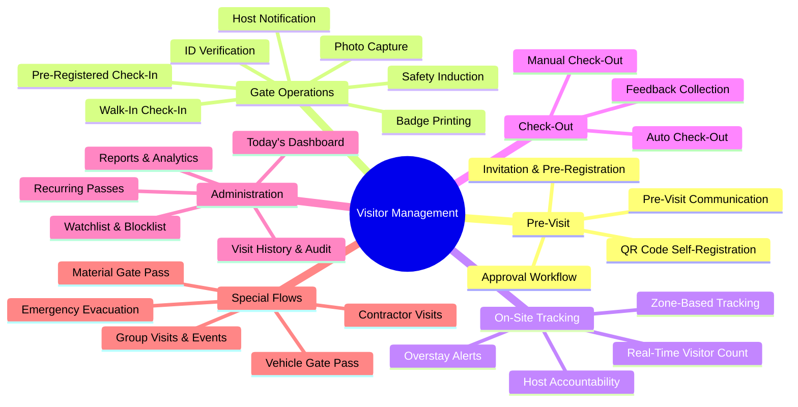

---

## 4. Visitor Lifecycle — End-to-End Flow

The following diagram shows the complete journey of a visitor through Avy ERP, from invitation to exit.

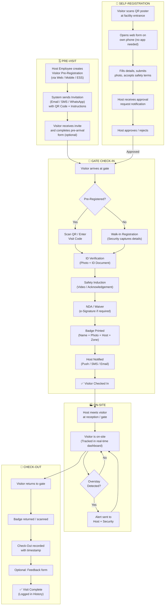

---

## 5. User Personas & Role-Based Access

### 5.1 Primary Users

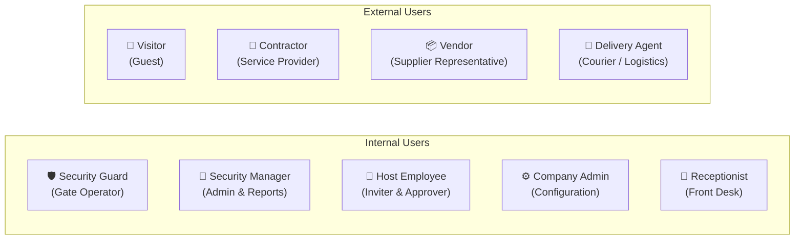

### 5.2 Role-Permission Matrix

| Capability | Security Guard | Security Manager | Host Employee | Receptionist | Company Admin |
|---|---|---|---|---|---|
| Check-in visitors at gate | ✅ | ✅ | ❌ | ✅ | ❌ |
| Check-out visitors | ✅ | ✅ | ❌ | ✅ | ❌ |
| View Today's Visitors Dashboard | ✅ | ✅ | ✅ (own guests) | ✅ | ✅ |
| Pre-register visitors | ❌ | ✅ | ✅ | ✅ | ✅ |
| Approve/Reject visitor requests | ❌ | ✅ | ✅ (own guests) | ❌ | ✅ |
| View Visit History | ❌ | ✅ | ✅ (own guests) | ✅ (limited) | ✅ |
| Manage Watchlist / Blocklist | ❌ | ✅ | ❌ | ❌ | ✅ |
| Configure VMS Settings | ❌ | ❌ | ❌ | ❌ | ✅ |
| Generate Reports | ❌ | ✅ | ❌ | ❌ | ✅ |
| Trigger Emergency Evacuation | ✅ | ✅ | ❌ | ❌ | ✅ |
| Create Recurring Passes | ❌ | ✅ | ✅ | ✅ | ✅ |
| Issue Vehicle Gate Pass | ✅ | ✅ | ❌ | ✅ | ✅ |
| Export Visit Logs | ❌ | ✅ | ❌ | ❌ | ✅ |

---

## 6. Visitor Types & Classification

Every visitor must be classified at the time of registration. The visitor type drives the check-in workflow, badge design, access permissions, and safety requirements.

### 6.1 Visitor Type Master

| Visitor Type | Code | Description | Typical Check-In Flow | Badge Colour |
|---|---|---|---|---|
| Business Guest | `BG` | Client, partner, or prospective customer visiting for a meeting | Pre-registration → QR Scan → Badge → Host Notified | 🔵 Blue |
| Vendor / Supplier | `VN` | Representative of a vendor visiting for procurement, delivery coordination, or account management | Pre-registration (often linked to PO) → ID Check → Badge | 🟢 Green |
| Contractor / Service Provider | `CT` | Technician, AMC engineer, or outsourced worker performing maintenance, installation, or repair | Pre-registration + Safety Induction + NDA → Badge → Escorted | 🟠 Orange |
| Delivery Agent | `DA` | Courier, logistics, or raw material delivery personnel | Walk-in → Quick Registration → Goods Verification → Temporary Badge | 🟡 Yellow |
| Government / Regulatory Inspector | `GI` | Labour inspector, factory inspector, pollution control board, tax officer | Walk-in or Appointment → ID Verification → VIP Badge → Senior Host Notified | 🔴 Red |
| Job Candidate / Interviewee | `JC` | Person visiting for a recruitment interview | Pre-registration by HR → QR Scan → Badge → HR Host Notified | 🟣 Purple |
| Family / Personal Visitor | `FV` | Employee's family member or personal guest (if allowed by company policy) | Walk-in → Basic Registration → Employee Host Approval → Temporary Badge | ⚪ White |
| VIP / Board Member | `VP` | Senior executive, board member, investor, or dignitary | Pre-registration by Admin/EA → Expedited Check-In → VIP Badge → Escort Arranged | 🥇 Gold |
| Auditor | `AU` | Internal or external auditor (financial, quality, safety, compliance) | Pre-registration → Full ID Verification → Badge with Audit Access Zones | ⬛ Black |
| Event Attendee | `EA` | Person attending a company event, training, seminar, or open day | Group Pre-registration → Batch Check-In → Event Badge | 🩵 Teal |
| Delivery Vehicle Driver | `DV` | Driver who remains at the gate or loading dock while goods are processed | Walk-in → Minimal Registration → Waiting Area Badge | 🟤 Brown |

### 6.2 Custom Visitor Types

The Company Admin can define additional visitor types specific to their facility:

| Configuration | Description |
|---|---|
| Type Name | Custom label (e.g., "Apprentice", "Consultant", "Media") |
| Type Code | Unique 2–3 character code |
| Badge Colour | Assigned colour for visual identification |
| Default Safety Induction | Which induction video/document is shown at check-in |
| NDA Required | Yes / No |
| Photo Capture Required | Yes / No |
| ID Verification Required | Yes / No |
| Host Approval Required | Yes / No — and at which stage (pre-registration or gate) |
| Maximum Visit Duration | Auto-checkout trigger duration (e.g., 4 hours, 8 hours) |
| Allowed Zones | Which areas of the facility the visitor may access |
| Escort Required | Whether the visitor must be accompanied by the host at all times |

---

## 7. Pre-Registration & Invitation Workflow

Pre-registration is the **preferred and recommended** way for visitors to enter an Avy ERP facility. It allows hosts to register their expected visitors in advance, enabling faster gate check-in, better security preparation, and a more professional visitor experience.

### 7.1 Pre-Registration Flow

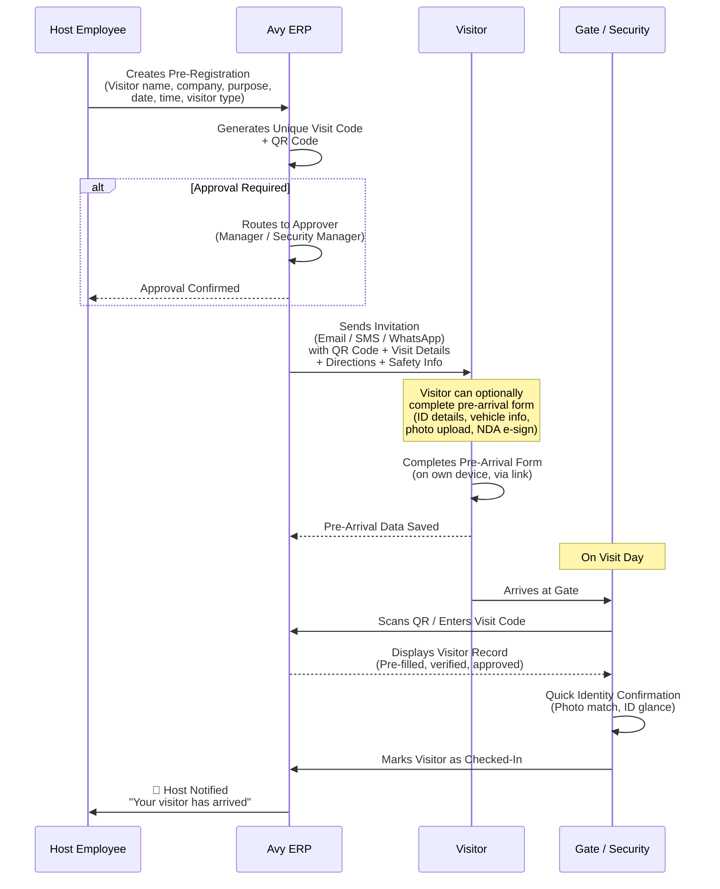

### 7.2 Pre-Registration Data Fields

| Field | Required | Notes |
|---|---|---|
| Visitor Full Name | ✅ Yes | |
| Visitor Mobile Number | ✅ Yes | For sending invitation and OTP |
| Visitor Email | No | For formal invitation email |
| Visitor Company / Organisation | No | |
| Visitor Type | ✅ Yes | From Visitor Type Master |
| Purpose of Visit | ✅ Yes | Dropdown: Meeting, Delivery, Maintenance, Audit, Interview, Site Tour, Personal, Other |
| Purpose Notes | No | Free text — additional context |
| Expected Date of Visit | ✅ Yes | Single date or date range |
| Expected Arrival Time | No | Approximate arrival time |
| Expected Duration | No | Hours — used for overstay alert |
| Host Employee | ✅ Yes | Selected from Employee Master (auto-complete search) |
| Department to Visit | No | |
| Plant / Location | ✅ Yes | If multi-plant; auto-defaults to host's plant |
| Gate / Entry Point | No | If multi-gate; auto-defaults to primary gate |
| Number of Accompanying Persons | No | For group visits |
| Vehicle Details (Reg. Number, Type) | No | If visitor is driving |
| Material / Equipment Carried | No | For security clearance |
| Special Instructions | No | Parking directions, dress code, PPE requirements |
| Approval Required | Auto | Based on visitor type and company policy |
| Approver | Auto | Based on approval matrix |

### 7.3 Invitation Content

When a pre-registration is confirmed, the system sends an invitation to the visitor containing:

| Component | Description |
|---|---|
| Visit Confirmation | "Your visit to [Company Name] has been confirmed" |
| Visit Date & Time | Expected date, arrival time, estimated duration |
| Host Name & Designation | Who the visitor is meeting |
| Facility Address | Full address with Google Maps link |
| Directions / Parking | Custom text configured per plant |
| QR Code | Unique QR code for instant gate check-in |
| Visit Code | 6-digit alphanumeric code (fallback if QR scan fails) |
| Safety Instructions | "Please wear closed-toe shoes. Safety gear will be provided at the gate." |
| Pre-Arrival Form Link | URL to complete details in advance (optional) |
| Contact Number | Facility reception or security contact |
| What to Bring | ID proof, vehicle registration (if driving) |
| Company Logo & Branding | Branded invitation reflecting company identity |

### 7.4 Pre-Arrival Form (Visitor Completes Before Arrival)

This optional web form allows visitors to submit their details before arriving, making gate check-in nearly instant.

| Field | Notes |
|---|---|
| Full Name | Pre-filled from invitation |
| Photo Upload | Selfie or passport photo |
| Government ID Type | Aadhaar, PAN, Passport, Driving Licence, Voter ID |
| Government ID Number | |
| ID Photo Upload | Photo of the ID document (front + back) |
| Vehicle Registration Number | If driving |
| Vehicle Type | Car, Two-Wheeler, Auto, Truck, Van |
| Laptop Serial Number | If carrying a laptop |
| Material Declaration | List of items being brought in |
| NDA / Confidentiality Agreement | e-Signature on digital NDA |
| Safety Acknowledgement | Checkbox: "I have read and understood the safety guidelines" |
| Emergency Contact | Name + Mobile number |

---

## 8. Self-Registration — QR Code Flow

For visitors who are **not pre-registered** but arrive at a facility that has QR-based self-registration enabled, Avy ERP offers a completely contactless, app-free self-registration process.

### 8.1 QR Self-Registration Flow

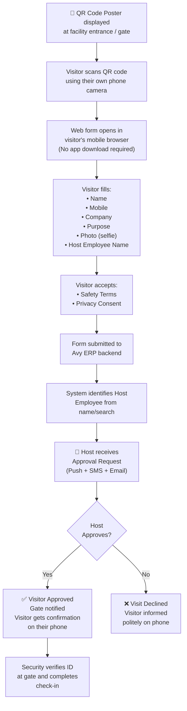

### 8.2 QR Poster Configuration

| Setting | Description |
|---|---|
| QR Code URL | Unique URL per plant/gate — e.g., `https://avyerp.com/visit/PLT-BLR-01` |
| Poster Design | Company-branded poster with logo, QR code, and short instructions |
| Language Options | Multi-language support on the web form (English, Hindi, Kannada, Tamil, etc.) |
| Form Fields | Configurable — admin chooses which fields are shown to walk-in self-registrants |
| Auto-Expire | QR code can be set to rotate monthly for security |
| Rate Limiting | Prevent spam — max 5 submissions per phone number per day |

---

## 9. Walk-In Visitor Flow

Walk-in visitors are those who arrive at the gate **without any prior registration** and **without using QR self-registration**. The security guard or receptionist captures their details manually.

### 9.1 Walk-In Check-In Process

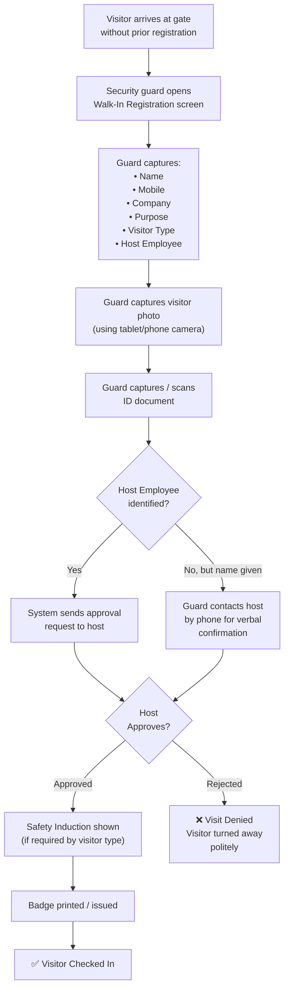

---

## 10. Check-In Process & Gate Operations

The gate check-in screen is the **primary operational screen** used by security guards. It must be designed for speed, clarity, and reliability.

### 10.1 Gate Check-In Screen Layout

The gate check-in screen should display the following sections:

| Section | Content |
|---|---|
| **Expected Visitors Panel** (Left) | List of all pre-registered visitors expected today, with status badges (Expected / Arrived / Checked In / No Show). Sorted by expected arrival time. Searchable by name. |
| **Active Check-In Form** (Centre) | The form currently being filled — either for a walk-in or a pre-registered visitor being processed. |
| **Today's Stats Bar** (Top) | Total Expected · Checked In · Checked Out · Currently On-Site · Walk-Ins · Overstaying |
| **Quick Actions** (Right) | Buttons: New Walk-In · Scan QR · Search Visitor · Emergency Muster · Print Badge |

### 10.2 Check-In Steps (Sequential)

For every visitor, the system enforces a configurable sequence of check-in steps:

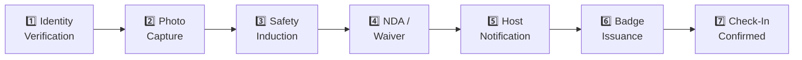

Each step can be toggled ON/OFF per visitor type by the Company Admin. For example:

| Step | Business Guest | Contractor | Delivery Agent | VIP |
|---|---|---|---|---|
| Identity Verification | ✅ | ✅ | ✅ | ✅ |
| Photo Capture | ✅ | ✅ | Optional | ❌ (pre-captured) |
| Safety Induction | ❌ | ✅ | ❌ | ❌ |
| NDA / Waiver | Optional | ✅ | ❌ | ❌ |
| Host Notification | ✅ | ✅ | ✅ | ✅ (to PA/EA) |
| Badge Issuance | ✅ | ✅ | ✅ (temporary) | ✅ (VIP badge) |

### 10.3 Identity Verification Methods

| Method | Description | When Used |
|---|---|---|
| Government ID Scan | Guard scans or photographs the visitor's Aadhaar, PAN, DL, Passport, or Voter ID | Default for all visitor types |
| QR Code Scan | Visitor shows the QR code from their invitation; system pulls up pre-registered record | Pre-registered visitors |
| Visit Code Entry | 6-digit code entered manually | When QR scan fails or visitor shows code on printout |
| OTP Verification | System sends OTP to visitor's registered mobile; visitor provides OTP at gate | High-security facilities |
| Facial Recognition | Camera at gate matches visitor's face against pre-uploaded photo or ID | Advanced — future feature |
| Biometric (Fingerprint) | For recurring contractors with enrolled biometrics | Advanced — future feature |

---

## 11. Visitor Badge & Identification

Visitor badges serve two critical purposes: they make visitors **instantly identifiable** by any employee on the premises, and they define the **zones and duration** for which the visitor is authorised.

### 11.1 Badge Content

| Badge Element | Description |
|---|---|
| Visitor Name | Full name in large, readable font |
| Visitor Photo | Captured at check-in or from pre-registration |
| Company / Organisation | Visitor's company name |
| Host Employee Name | Who the visitor is meeting |
| Department | Department being visited |
| Purpose | Brief purpose of visit |
| Visitor Type | With colour coding (e.g., "CONTRACTOR" in orange) |
| Badge Number | Unique badge ID (from No Series) |
| Visit Date | Today's date |
| Valid Until | Auto-calculated from expected duration |
| Allowed Zones | Zones or areas the visitor may access |
| QR Code on Badge | For zone-entry scanning and quick check-out |
| Company Logo | Facility branding |
| Emergency Contact | Facility emergency number |

### 11.2 Badge Formats

| Format | Use Case |
|---|---|
| Printed Badge (Adhesive Label) | Standard — printed at gate on a label printer; worn on clothing |
| Printed Badge (Card) | Reusable PVC card for recurring visitors/contractors |
| Digital Badge (on Visitor's Phone) | Shown on phone screen — for tech-forward facilities |
| Lanyard Badge (Pre-printed) | For VIPs and event attendees |
| Colour-Coded Wristband | For large events or factory tours |

### 11.3 Badge Printing Configuration

| Setting | Description |
|---|---|
| Printer Model | Supported label/badge printers (Zebra, Brother, Dymo, etc.) |
| Badge Template | Configurable layout — admin can adjust fields, logo position, colour scheme |
| Auto-Print on Check-In | Badge prints automatically when check-in is completed |
| Badge Size | Standard: 3.5" × 2.5" (horizontal) or custom |
| Badge Expiry Visual | Badge background changes to red after expiry time |

---

## 12. Safety Induction & Compliance at Check-In

For **manufacturing facilities**, safety induction at check-in is not optional — it is a regulatory and operational necessity. Avy ERP enforces safety compliance as part of the visitor check-in flow.

### 12.1 Safety Induction Types

| Induction Type | Description | Duration | When Shown |
|---|---|---|---|
| Safety Video | Short video (60–180 seconds) covering plant safety rules, PPE requirements, emergency exits, and prohibited actions | 1–3 min | Shown on tablet/kiosk during check-in |
| Safety Slide Deck | Series of slides with photos and instructions | 1–2 min | Alternative to video for low-bandwidth |
| Safety Questionnaire | 3–5 multiple-choice questions to confirm understanding | 1 min | After video/slides — must pass to proceed |
| PPE Acknowledgement | Checklist of PPE items visitor will receive (helmet, goggles, safety shoes, ear plugs, hi-vis vest) | 30 sec | Visitor checks each item received |
| Safety Declaration Form | Formal declaration: "I understand and agree to follow all safety rules" | 30 sec | e-Signature captured |
| Site-Specific Hazard Briefing | Text or visual briefing on specific hazards at this plant (chemicals, heavy machinery, high-voltage areas) | 1 min | For contractors and vendor reps visiting production zones |

### 12.2 Safety Induction Configuration

| Setting | Description |
|---|---|
| Induction Content per Visitor Type | Different induction for contractors vs. business guests |
| Induction Content per Plant | Different plants may have different hazards and rules |
| Induction Language | Multi-language support — auto-detect from visitor's phone language or selectable |
| Pass Criteria (Questionnaire) | Minimum score to proceed (e.g., 4 out of 5 correct) |
| Failed Induction Action | Retry allowed (max 2 attempts) → Failing again requires security manager intervention |
| Induction Validity | How long a completed induction remains valid (e.g., 30 days). Repeat visitors within validity period skip re-induction. |
| Induction Completion Log | Stored with visitor record — timestamp, score, content version |
| PPE Issue Tracking | Which PPE items were issued — linked to badge number for return tracking |

### 12.3 NDA & Document Signing

| Setting | Description |
|---|---|
| NDA Template | Configurable NDA document per visitor type |
| e-Signature Capture | Visitor signs on tablet screen |
| Document Storage | Signed NDA stored as PDF in visitor's digital record |
| NDA Validity | Duration for which a signed NDA remains valid (e.g., 12 months) |
| Waiver Documents | Liability waivers for factory tours, site visits |
| Conditional Access Agreement | Visitor agrees to restricted zone conditions |

---

## 13. Host Notification & Approval Engine

### 13.1 Notification Flow

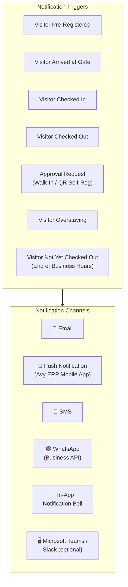

### 13.2 Notification Matrix

| Event | Recipient(s) | Channels | Priority |
|---|---|---|---|
| Pre-Registration Created | Host Employee | In-App, Email | Normal |
| Visitor Invitation Sent | Visitor | Email, SMS, WhatsApp | Normal |
| Visitor Arrived at Gate | Host Employee | Push, SMS | High |
| Visitor Checked In | Host Employee | Push, In-App | High |
| Approval Request (Walk-In) | Host Employee | Push, SMS, Email | Urgent |
| Approval Request (QR Self-Reg) | Host Employee | Push, SMS | Urgent |
| Approval Timeout (No Response) | Host's Manager (Escalation) | Push, SMS | Urgent |
| Visitor Checked Out | Host Employee | In-App | Low |
| Visitor Overstaying | Host Employee + Security Manager | Push, SMS | High |
| End-of-Day Unchecked-Out Visitors | Security Manager | Push, Email | High |
| Blocklisted Visitor Attempt | Security Manager | Push, SMS, Email | Critical |
| Emergency Evacuation Triggered | All on-site visitors (via SMS) | SMS | Critical |

### 13.3 Approval Workflow Configuration

| Setting | Description |
|---|---|
| Auto-Approve Pre-Registered | Pre-registered visitors are auto-approved at gate (no second approval needed) |
| Approval Required for Walk-Ins | Walk-in visitors require host approval before badge is issued |
| Approval Required for QR Self-Reg | Self-registered visitors require host approval |
| Approval Timeout | Minutes after which request escalates (e.g., 10 minutes) |
| Escalation Chain | Host → Host's Manager → Security Manager |
| Proxy Approver | If host is on leave, a designated proxy can approve |
| Auto-Reject After Timeout | If no response within N minutes, auto-reject with polite message |
| Bulk Approval | For group visits — host can approve all members at once |

---

## 14. Visitor Tracking & On-Site Monitoring

### 14.1 Real-Time On-Site Count

The system maintains a real-time count of all visitors currently on-site. This count is prominently displayed on the Today's Visitors Dashboard and is available to all authorised users.

| Metric | Description |
|---|---|
| Total On-Site Now | Count of all visitors currently checked in but not checked out |
| By Visitor Type | Breakdown: Business Guests, Contractors, Delivery Agents, etc. |
| By Host Department | Which departments have the most visitors right now |
| By Plant / Location | For multi-plant — how many visitors at each plant |
| By Gate | For multi-gate — which gate had the most arrivals |
| Average Visit Duration (Today) | Mean time spent on-site by visitors checked out today |

### 14.2 Overstay Detection & Alerts

| Setting | Description |
|---|---|
| Expected Duration (per Visit) | Set during pre-registration or at check-in |
| Default Maximum Duration (per Type) | Configurable default: e.g., Business Guest = 4 hrs, Contractor = 8 hrs, Delivery = 2 hrs |
| Overstay Alert Threshold | Alert triggered X minutes after expected duration |
| Overstay Alert Recipients | Host Employee + Security Manager |
| Auto Check-Out | Optionally auto-check-out visitors at a hard cutoff time (e.g., 8 PM) |
| Repeated Overstay Flagging | Visitors who overstay frequently are flagged for security review |

### 14.3 Zone-Based Tracking (Advanced — Future Phase)

For facilities with zone-level access control, the system can track which zones a visitor has entered.

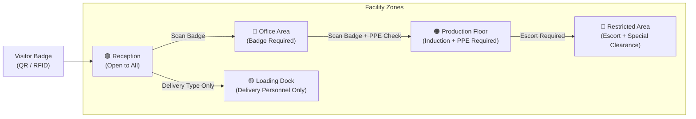

---

## 15. Check-Out Process

### 15.1 Check-Out Methods

| Method | Description | Best For |
|---|---|---|
| Gate Check-Out (Security) | Security guard scans badge or searches visitor record and marks as checked out | Standard — all visitor types |
| Self Check-Out (Kiosk) | Visitor scans their badge at a kiosk near the exit | Tech-forward facilities |
| Self Check-Out (Mobile) | Visitor clicks "Check Out" link sent via SMS/email | When visitor leaves without passing security desk |
| Auto Check-Out (Time-Based) | System auto-checks out visitors at a configured time (e.g., 8 PM) | End-of-day cleanup for forgotten check-outs |
| Host-Initiated Check-Out | Host employee marks the visitor as checked out from their app | When host walks visitor to the exit |
| Badge Return Trigger | Returning the physical badge to the desk triggers check-out | Ensures badge recovery |

### 15.2 Check-Out Data Captured

| Field | Notes |
|---|---|
| Check-Out Timestamp | Exact date and time |
| Check-Out Gate | Which gate the visitor exited from |
| Check-Out Method | How the check-out was performed |
| Badge Returned | Yes / No |
| Material Out | Any material being taken out (for security clearance) |
| Visit Duration | Auto-calculated: Check-Out Time − Check-In Time |
| Visitor Feedback | Optional short feedback (1–5 star rating + comment) |

---

## 16. Today's Visitors Dashboard

The Today's Visitors Dashboard is the **central command screen** for visitor operations. It provides a real-time, single-screen view of all visitor activity for the current day.

### 16.1 Dashboard Layout

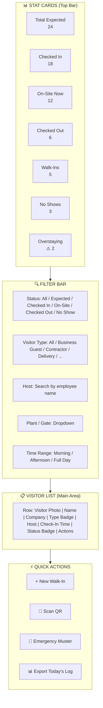

### 16.2 Status Badges

| Status | Colour | Icon | Meaning |
|---|---|---|---|
| Expected | 🔵 Blue | 🕐 Clock | Pre-registered but not yet arrived |
| Arrived | 🟡 Amber | 📍 Pin | At the gate, check-in in progress |
| Checked In | 🟢 Green | ✅ Check | On-site, properly checked in |
| Checked Out | ⚫ Grey | 🚶 Walk | Visit completed, exited |
| No Show | ⬜ Light Grey | ❌ Cross | Pre-registered but did not arrive |
| Overstaying | 🔴 Red | ⚠️ Alert | Exceeded expected visit duration |
| Rejected | 🔴 Red | 🚫 Block | Visit request was denied |
| Cancelled | ⬜ Light Grey | 🗑️ Trash | Pre-registration cancelled by host |

---

## 17. Visit History & Audit Trail

### 17.1 Visit History Screen

The Visit History screen provides a **searchable, filterable, exportable log** of all visits — past, present, and future.

| Filter | Options |
|---|---|
| Date Range | Custom date picker — from/to |
| Visitor Name | Search by name |
| Visitor Company | Search by organisation |
| Visitor Type | Dropdown — all types |
| Host Employee | Search by host name |
| Registration Method | Pre-Registered / QR Self-Registered / Walk-In |
| Status | Completed / No Show / Rejected / Cancelled |
| Plant / Location | Dropdown |
| Gate | Dropdown |

### 17.2 Visit Record Detail View

Clicking on any visit record opens a complete detail view:

| Section | Fields |
|---|---|
| Visitor Details | Name, Company, Mobile, Email, Photo, ID Document |
| Visit Details | Date, Purpose, Visitor Type, Visit Code, Badge Number |
| Host Details | Host Employee Name, Department, Designation |
| Timeline | Pre-Registration Time → Invitation Sent → Arrival → Check-In → Check-Out (each with timestamp) |
| Safety Compliance | Induction Completed (Yes/No, Score, Timestamp) · NDA Signed (Yes/No, PDF link) · PPE Issued (Items list) |
| Approval Trail | Who approved, when, from which channel |
| Gate Details | Check-In Gate, Check-Out Gate, Security Guard Name |
| Vehicle Details | Registration Number, Vehicle Type |
| Material In/Out | Items declared at entry and exit |
| Visit Duration | Calculated duration |
| Visitor Feedback | Rating + Comment (if collected) |
| Audit Log | Every action taken on this record with user, timestamp, and change details |

### 17.3 Audit Trail Fields

| Event | Data Captured |
|---|---|
| Visit Created | Created by, timestamp, method (Pre-Reg / Walk-In / QR) |
| Invitation Sent | Channel (Email/SMS/WhatsApp), timestamp, delivery status |
| Pre-Arrival Form Completed | Timestamp, fields filled |
| Approval Requested | Sent to (host name), timestamp |
| Approval Granted/Denied | Approved by, timestamp, channel |
| Check-In Completed | Security guard name, gate, timestamp |
| Badge Issued | Badge number, print status |
| Safety Induction Completed | Score, attempt count, timestamp |
| NDA Signed | Document version, e-signature timestamp |
| Check-Out Completed | Method, gate, timestamp |
| Badge Returned | Yes/No, timestamp |
| Record Modified | Field changed, old value, new value, changed by, timestamp |

---

## 18. Visitor Watchlist & Blocklist

### 18.1 Blocklist (Deny Entry)

A blocklist is a list of individuals who are **permanently or temporarily denied entry** to the facility.

| Field | Required | Notes |
|---|---|---|
| Person Name | ✅ Yes | |
| Mobile Number | No | For matching at check-in |
| Email | No | |
| ID Number (Aadhaar/PAN/DL) | No | For precise matching |
| Photo | No | For visual identification by guard |
| Reason for Blocking | ✅ Yes | Theft, Misconduct, Terminated Employee, Legal Order, Trespassing, etc. |
| Blocked By | Auto | User who added the entry |
| Block Date | Auto | |
| Block Duration | ✅ Yes | Permanent / Until [Date] |
| Applies To | No | All Plants / Specific Plant(s) |

**System Behaviour:** When a visitor's name, mobile, or ID number matches a blocklisted entry during check-in, the system immediately alerts the security guard with a **red warning banner** and blocks the check-in process. The Security Manager is also notified.

### 18.2 Watchlist (Flag for Attention)

A watchlist flags individuals who are **not blocked** but require **special attention or additional verification** at check-in.

| Field | Notes |
|---|---|
| Person Name | |
| Matching Criteria | Name, Mobile, ID Number |
| Watch Reason | Former Employee, Pending Investigation, Vendor Dispute, Repeated Overstay, etc. |
| Action Required | Additional ID check, Security Manager approval required, Escort mandatory |
| Added By | |
| Expiry Date | When the watchlist entry expires |

**System Behaviour:** When a watchlisted visitor checks in, the system shows a **yellow warning banner** to the security guard with the watch reason and required action. Check-in can proceed but only after the action is completed.

---

## 19. Multi-Gate & Multi-Plant Support

### 19.1 Multi-Gate Architecture

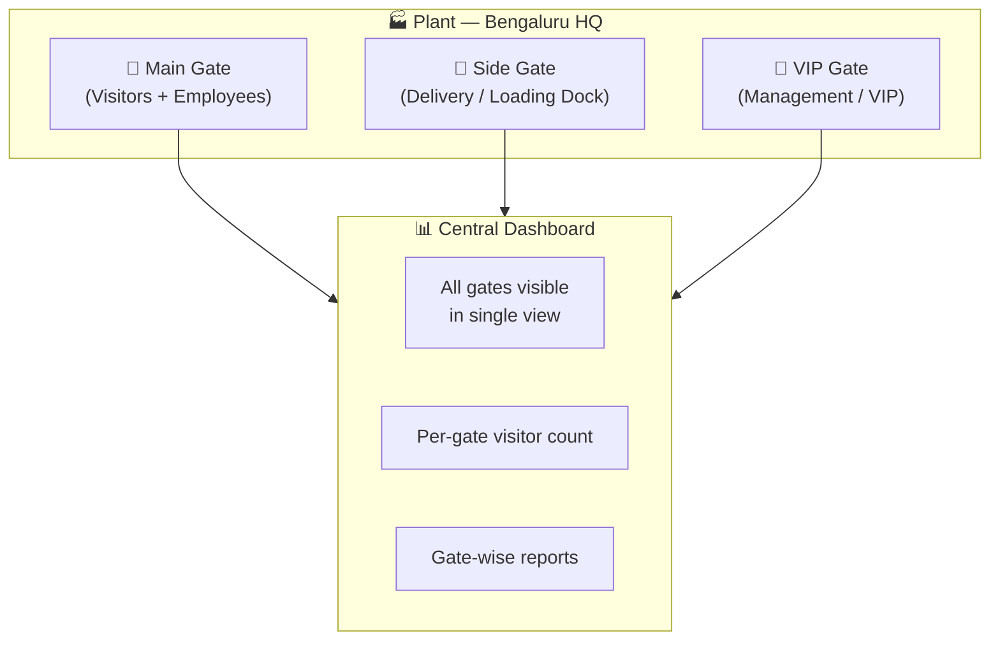

| Configuration | Description |
|---|---|
| Gate Name | e.g., "Main Gate", "Factory Gate 2", "Loading Bay" |
| Gate Code | Unique code; e.g., `GATE-BLR-01` |
| Gate Type | Main Entry, Service Entry, Loading Dock, VIP Entry, Emergency Exit |
| Plant Assignment | Which plant this gate belongs to |
| Allowed Visitor Types | Which visitor types can enter through this gate |
| Operating Hours | Gate open/close timings |
| Devices Assigned | Tablets, kiosks, badge printers at this gate |
| QR Poster URL | Unique QR self-registration URL for this gate |

### 19.2 Multi-Plant Support

When Multi-Plant Mode is enabled in Avy ERP, the Visitor Management module supports:

| Feature | Description |
|---|---|
| Plant-Level Visitor Dashboard | Each plant has its own Today's Visitors dashboard |
| Cross-Plant Visibility | Security Managers and Company Admins see all plants in a consolidated view |
| Plant-Specific Safety Inductions | Different induction content per plant |
| Plant-Specific Visitor Types | Custom visitor types per plant (if needed) |
| Plant-Specific Watchlist | Blocklist entries can be global or plant-specific |
| Centralised Reporting | Company-wide visitor analytics across all plants |
| Visitor Transfer Between Plants | If a visitor needs to move between plants, a transfer record is created |

---

## 20. Emergency Evacuation & Muster Management

In an emergency, knowing exactly who is on-site is **life-critical**. The Visitor Management Module provides instant muster list generation and real-time accountability.

### 20.1 Emergency Evacuation Flow

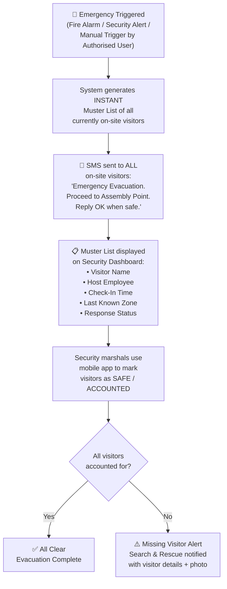

### 20.2 Muster List Fields

| Field | Description |
|---|---|
| Visitor Name | |
| Visitor Photo | For identification |
| Visitor Company | |
| Host Employee | |
| Check-In Time | |
| Visitor Type | |
| Badge Number | |
| Last Known Zone | If zone tracking is active |
| SMS Sent Status | Delivered / Failed |
| Visitor Response | OK / No Response |
| Marshal Status | Safe / Missing / Injured / Evacuated |
| Marked By | Marshal name + timestamp |

### 20.3 Evacuation Configuration

| Setting | Description |
|---|---|
| Emergency Trigger Access | Which roles can trigger an evacuation (Security Guard, Security Manager, Company Admin, Plant Manager) |
| Assembly Points | Defined assembly points per plant/gate |
| SMS Template | Configurable emergency SMS text |
| Auto-Trigger on Fire Alarm | Integration with building fire alarm system (optional) |
| Drill Mode | Run evacuation drill without sending real SMS to visitors — internal muster list only |
| Post-Evacuation Report | Auto-generated report: total on-site, response rate, time to full accountability |

---

## 21. Contractor & Vendor Visit Management

Contractors and vendors are the most frequent and most compliance-sensitive visitor category in manufacturing facilities.

### 21.1 Contractor-Specific Check-In Requirements

| Requirement | Description |
|---|---|
| Work Permit Verification | Contractor must have a valid work permit or purchase order reference |
| Safety Induction (Mandatory) | Full safety induction with questionnaire — no bypass allowed |
| Toolbox / Equipment Declaration | List of tools and equipment being brought in |
| Insurance / Licence Verification | Upload and verify contractor's insurance certificate, trade licence |
| Contractor Company Verification | Verify the contracting company is an approved vendor in the Vendor Master |
| PPE Issuance (Mandatory) | Full PPE kit issued and acknowledged |
| NDA / Confidentiality Agreement | Mandatory for contractors accessing production areas |
| Escort Requirement | Configurable — escort required in restricted zones |
| Work Area / Zone Assignment | Define which zones the contractor may access |
| Daily Re-Check-In | Contractors working multi-day jobs must check in each day |

### 21.2 Vendor Visit — Linked to Purchase Orders

When a vendor representative visits, the visit can be linked to an active Purchase Order (PO) from the Vendor Management module:

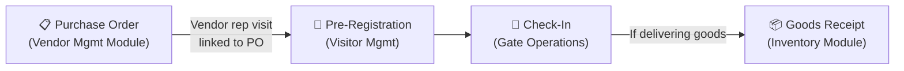

---

## 22. Group Visit & Event Management

### 22.1 Group Visit Flow

For situations where multiple visitors arrive together (factory tour, training session, audit team, vendor delegation):

| Feature | Description |
|---|---|
| Group Pre-Registration | Host registers the group with a group name and uploads a list of attendees (CSV or manual entry) |
| Group Visit Code | Single QR / visit code for the entire group |
| Batch Check-In | Security can check in all members at once or individually |
| Group Badge Printing | Batch print badges for all group members |
| Group Induction | Single induction session for the group (not repeated per person) |
| Group Host | One host employee responsible for the entire group |
| Group Check-Out | Batch check-out or individual check-out |

### 22.2 Event Management

For company-hosted events (open days, seminars, customer meets):

| Feature | Description |
|---|---|
| Event Creation | Create an event with name, date, time, venue, expected attendees |
| Event Registration Link | Public URL where invitees can register for the event |
| Event QR Code | Unique QR for the event — displayed at venue entry |
| Event Attendee List | Separate from daily visitor list — event-specific dashboard |
| Event Badge | Custom badge design for the event |
| Event Check-In/Check-Out | Mass operations for large groups |
| Post-Event Report | Total registrations, actual attendees, no-shows, check-in/check-out times |

---

## 23. Recurring Visitor & Frequent Visitor Pass

For visitors who visit regularly (e.g., AMC technicians, vendor account managers, regular consultants), creating a new registration every time is inefficient. Avy ERP supports recurring passes.

### 23.1 Recurring Pass Configuration

| Field | Required | Notes |
|---|---|---|
| Visitor Name | ✅ Yes | |
| Visitor Company | ✅ Yes | |
| Visitor Mobile | ✅ Yes | |
| Visitor Photo | ✅ Yes | Captured once, reused for all visits |
| Visitor ID Number | ✅ Yes | |
| Pass Type | ✅ Yes | Weekly Pass / Monthly Pass / Quarterly Pass / Annual Pass |
| Valid From | ✅ Yes | |
| Valid Until | ✅ Yes | |
| Allowed Days | No | e.g., Mon–Fri only, or specific days |
| Allowed Time Window | No | e.g., 9 AM – 6 PM |
| Allowed Gates | No | |
| Allowed Zones | No | |
| Host Employee | ✅ Yes | Default host for each visit |
| Purpose | ✅ Yes | |
| Safety Induction Status | Auto | Once completed, valid for pass duration |
| Pass Number | Auto | From No Series |
| Issued By | Auto | |
| Status | Auto | Active / Expired / Revoked |

### 23.2 Recurring Pass Check-In

When a recurring pass holder arrives:
1. Scan the pass QR code or enter pass number
2. System validates: pass is active, within valid dates, allowed day, allowed time, correct gate
3. If valid — quick check-in (no re-registration, no re-induction)
4. Badge prints with "Recurring Pass" indicator
5. Host is notified
6. If expired or revoked — system blocks entry and alerts security

---

## 24. Vehicle & Material Gate Pass

### 24.1 Vehicle Gate Pass

| Field | Required | Notes |
|---|---|---|
| Vehicle Registration Number | ✅ Yes | |
| Vehicle Type | ✅ Yes | Car, Two-Wheeler, Auto, Truck, Van, Tempo, Bus |
| Driver Name | ✅ Yes | |
| Driver Mobile | No | |
| Driver ID | No | |
| Purpose | ✅ Yes | Delivery, Pick-Up, Visitor Vehicle, Employee Vehicle, Contractor Vehicle |
| Associated Visit Record | No | Link to the visitor's visit record (if applicable) |
| Parking Zone Assigned | No | Where the vehicle should be parked |
| Material In Vehicle | No | Declaration of goods being transported |
| Entry Time | Auto | |
| Exit Time | Auto | |
| Vehicle Photo | No | Captured at gate (front + back) |
| Gate Pass Number | Auto | From No Series |

### 24.2 Material Gate Pass

For tracking material entering or leaving the facility with a visitor:

| Field | Required | Notes |
|---|---|---|
| Gate Pass Type | ✅ Yes | Inward (Material In) / Outward (Material Out) / Returnable |
| Material Description | ✅ Yes | What is being brought in or taken out |
| Quantity | No | |
| Associated Visit Record | No | Link to visitor |
| Associated PO / GRN | No | Link to Vendor Mgmt / Inventory |
| Authorised By | ✅ Yes | Employee who authorised the material movement |
| Purpose | ✅ Yes | Delivery, Repair, Replacement, Sample, Return, Personal |
| Expected Return Date | Conditional | For returnable gate passes |
| Returned | Auto | Status tracking for returnable items |
| Gate Pass Number | Auto | From No Series |

---

## 25. Notification & Communication Configuration

### 25.1 Configurable Notification Templates

Every notification sent by the VMS is based on a template that the Company Admin can customise:

| Template | Default Channel | Customisable Fields |
|---|---|---|
| Visitor Invitation | Email + SMS | Subject, body text, company logo, directions, safety info |
| Visit Code / QR | SMS + WhatsApp | Message text |
| Host Alert — Visitor Arrived | Push + SMS | Message text |
| Host Alert — Approval Required | Push + SMS + Email | Message text, timeout duration |
| Visitor — Visit Confirmed | SMS | Confirmation text |
| Visitor — Visit Rejected | SMS | Polite rejection text |
| Overstay Alert | Push + SMS | Alert text, escalation instructions |
| End-of-Day Reminder | Email | List of unchecked-out visitors |
| Emergency Evacuation | SMS | Emergency text, assembly point |
| Blocklist Match Alert | Push + SMS + Email | Alert text with visitor details |
| Recurring Pass Expiry | Email + In-App | Expiry notice, renewal instructions |
| Visitor Feedback Request | SMS / Email | Post-visit feedback link |

### 25.2 Communication Channels Configuration

| Channel | Setup Required | Notes |
|---|---|---|
| Email | SMTP server configuration (inherited from tenant setup) | Used for formal invitations, reports |
| SMS | SMS gateway API credentials | Used for visitor codes, host alerts, emergency |
| WhatsApp | WhatsApp Business API configuration | Used for rich invitations with QR images |
| Push Notification | Avy ERP Mobile App must be installed | Used for host alerts, approvals |
| In-App Notification | Built-in — no configuration needed | Used for low-priority alerts |
| Microsoft Teams / Slack | Webhook URL configuration | Optional — for tech-forward companies |

---

## 26. Data Fields — Complete Field Reference

### 26.1 Visit Record (Core Entity)

| Field Name | Data Type | Required | Source | Notes |
|---|---|---|---|---|
| Visit ID | Auto-generated | ✅ | System | Unique identifier from No Series |
| Visit Code | 6-char Alphanumeric | ✅ | System | Shown to visitor for gate check-in |
| QR Code | Image (generated) | ✅ | System | Encodes Visit Code |
| Visitor Full Name | Text | ✅ | Pre-Reg / Walk-In / QR | |
| Visitor Mobile | Phone | ✅ | Pre-Reg / Walk-In / QR | |
| Visitor Email | Email | No | Pre-Reg | |
| Visitor Company | Text | No | Pre-Reg / Walk-In / QR | |
| Visitor Designation | Text | No | Pre-Reg | |
| Visitor Photo | Image | Configurable | Gate Camera / Pre-Arrival | |
| Government ID Type | Dropdown | Configurable | Gate / Pre-Arrival | Aadhaar, PAN, DL, Passport, Voter ID |
| Government ID Number | Text | Configurable | Gate / Pre-Arrival | |
| ID Document Photo | Image | Configurable | Gate | |
| Visitor Type | Dropdown | ✅ | Pre-Reg / Walk-In | From Visitor Type Master |
| Purpose of Visit | Dropdown + Text | ✅ | Pre-Reg / Walk-In | |
| Host Employee ID | FK (Employee Master) | ✅ | Pre-Reg / Walk-In | |
| Host Employee Name | Text (derived) | Auto | System | |
| Host Department | Text (derived) | Auto | System | |
| Plant / Location | FK (Plant Master) | ✅ | Pre-Reg / System | |
| Gate | FK (Gate Master) | No | Pre-Reg / System | |
| Expected Date | Date | ✅ | Pre-Reg | |
| Expected Time | Time | No | Pre-Reg | |
| Expected Duration (hours) | Number | No | Pre-Reg | |
| Registration Method | Enum | Auto | System | Pre-Registered / QR Self-Reg / Walk-In |
| Approval Status | Enum | Auto | System | Pending / Approved / Rejected / Auto-Approved |
| Approved By | FK (Employee) | Auto | System | |
| Approval Timestamp | DateTime | Auto | System | |
| Check-In Time | DateTime | Auto | Gate | |
| Check-In Gate | FK (Gate) | Auto | Gate | |
| Check-In Security Guard | FK (Employee) | Auto | Gate | |
| Badge Number | Text | Auto | System | From No Series |
| Safety Induction Status | Enum | Auto | System | Not Required / Pending / Completed / Failed |
| Safety Induction Score | Number | Auto | System | |
| Safety Induction Timestamp | DateTime | Auto | System | |
| NDA Signed | Boolean | Auto | System | |
| NDA Document | File (PDF) | Auto | System | |
| PPE Issued | JSON | Auto | System | List of items |
| Check-Out Time | DateTime | Auto | Gate | |
| Check-Out Gate | FK (Gate) | Auto | Gate | |
| Check-Out Method | Enum | Auto | System | Manual / Self / Auto / Host-Initiated |
| Badge Returned | Boolean | Auto | Gate | |
| Visit Duration (minutes) | Number | Auto | System | Calculated |
| Visit Status | Enum | Auto | System | Expected / Checked-In / Checked-Out / No-Show / Cancelled / Rejected |
| Visitor Feedback Rating | Number (1-5) | No | Visitor | |
| Visitor Feedback Comment | Text | No | Visitor | |
| Vehicle Registration | Text | No | Pre-Reg / Gate | |
| Vehicle Type | Dropdown | No | Pre-Reg / Gate | |
| Material Carried In | Text | No | Gate | |
| Material Carried Out | Text | No | Gate | |
| Special Instructions | Text | No | Pre-Reg | |
| Emergency Contact | Text | No | Pre-Arrival / Gate | |
| Associated PO Number | FK (Purchase Order) | No | Pre-Reg | For vendor visits |
| Group Visit ID | FK (Group Visit) | No | System | If part of a group |
| Recurring Pass ID | FK (Recurring Pass) | No | System | If using a recurring pass |
| Created By | FK (User) | Auto | System | |
| Created At | DateTime | Auto | System | |
| Last Modified By | FK (User) | Auto | System | |
| Last Modified At | DateTime | Auto | System | |

---

## 27. Number Series Configuration for VMS

The following No Series records should be created for the Visitor Management module (linked screen: "Visitor Management"):

| Series | Code | Default Prefix | Count | Example Output | Description |
|---|---|---|---|---|---|
| Visit ID | `VISIT` | `VIS-` | 6 | `VIS-000001` | Unique visit record identifier |
| Badge Number | `BADGE` | `B-` | 5 | `B-00001` | Printed badge serial number |
| Recurring Pass | `RPASS` | `RP-` | 4 | `RP-0001` | Recurring pass number |
| Vehicle Gate Pass | `VGPASS` | `VGP-` | 5 | `VGP-00001` | Vehicle entry/exit pass |
| Material Gate Pass | `MGPASS` | `MGP-` | 5 | `MGP-00001` | Material in/out gate pass |
| Group Visit | `GVISIT` | `GV-` | 4 | `GV-0001` | Group visit batch number |

When Multi-Plant Mode is ON with Per-Plant configuration, the plant code is auto-embedded in the prefix (e.g., `VIS-PUN-000001`).

---

## 28. Reports & Analytics

### 28.1 Standard VMS Reports

| Report | Frequency | Audience | Description |
|---|---|---|---|
| Daily Visitor Log | Daily | Security Manager | Complete list of all visitors for a specific date |
| Weekly Visitor Summary | Weekly | Management | Total visitors, breakdown by type, top hosts, peak hours |
| Monthly Visitor Analytics | Monthly | Management, HR | Trends, comparisons, visitor volume by department |
| Overstay Report | On-Demand | Security Manager | List of visitors who exceeded expected duration |
| No-Show Report | On-Demand | Hosts, Admin | Pre-registered visitors who did not arrive |
| Watchlist / Blocklist Incident Report | On-Demand | Security Manager | Attempted entries by flagged individuals |
| Contractor Compliance Report | Monthly | Safety Officer | Contractor induction completion, NDA status, PPE issuance |
| Gate-wise Traffic Report | Daily/Weekly | Security Manager | Visitor volume per gate |
| Plant-wise Visitor Report | Monthly | Plant Manager | Visitor volume per plant |
| Vehicle Gate Pass Report | On-Demand | Security Manager | All vehicle entries/exits |
| Material Gate Pass Report | On-Demand | Security, Stores | All material movements |
| Emergency Drill Report | Per Drill | Safety Officer | Muster list accuracy, response time, accountability rate |
| Host-wise Visitor Report | On-Demand | HR, Admin | Which employees invite the most visitors |
| Visitor Feedback Report | Monthly | Admin, HR | Aggregate visitor satisfaction ratings |
| Peak Hours Analysis | Monthly | Operations | Busiest times for visitor arrivals — for staffing gate |

### 28.2 Analytics Dashboard

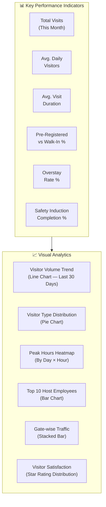

---

## 29. Integration with Other Avy ERP Modules

The Visitor Management module does not operate in isolation. It is deeply integrated with multiple Avy ERP modules for a seamless operational experience.

### 29.1 Integration Map

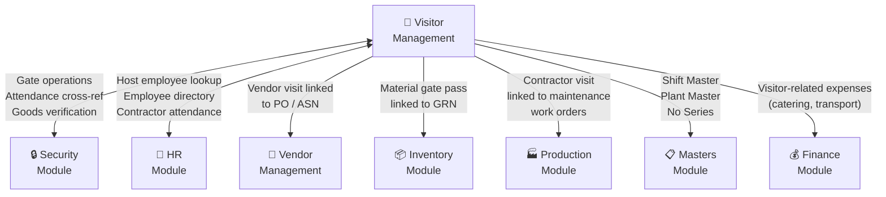

### 29.2 Integration Details

| Integration | Direction | Data Flow | Description |
|---|---|---|---|
| **VMS → Security** | Bidirectional | Visitor check-in/check-out data; expected visitor list for the day; gate operations | Security module is the operational layer at the gate. VMS provides the visitor records; Security provides the gate interface. They share the same gate screen. |
| **VMS → HR** | Read | Host Employee lookup — VMS queries Employee Master for host verification, department, designation, plant assignment | When a host is selected during pre-registration, VMS pulls employee details from HR. |
| **VMS → HR (Contractor Attendance)** | Write | For contractors who visit daily (e.g., outsourced security, housekeeping), their check-in/check-out times can be fed into HR attendance for contract workforce tracking | Optional integration for companies managing contract labour through VMS. |
| **VMS → Vendor Management** | Read | When a vendor representative visits, VMS can link the visit to an active Purchase Order (PO) or Advance Shipping Notice (ASN) from Vendor Management | Provides context to the gate guard: "This vendor is here for PO #12345 — expected delivery of 500 units of Part X." |
| **VMS → Inventory** | Write | When a delivery agent checks in with materials, VMS can trigger a Goods Receipt Note (GRN) workflow in Inventory | Seamless flow: Delivery agent checks in → Security verifies goods against ASN → GRN created in Inventory. |
| **VMS → Production (Maintenance)** | Read | When a contractor visits for machine maintenance, the visit can be linked to a Maintenance Work Order from the Machine Maintenance module | Provides context: "Contractor from ABC Services is here for PM Task #WO-1234 on CNC Machine 5." |
| **VMS → Masters** | Read | VMS inherits Shift Master (for gate operating hours), Plant Master (for multi-plant support), and No Series (for visit ID, badge, gate pass numbering) | Configuration data shared from tenant onboarding. |
| **VMS → Finance** | Write | Optional — visitor-related expenses (catering for group visits, transport for VIPs, PPE costs for contractors) can be booked as expenses in Finance | For companies that want to track visitor-related costs. |

### 29.3 Dependency Relationship

As per the Master PRD (Section 11), the Visitor Management module has a dependency on the Security Module:

| Module Activated | Auto-Includes | Reason |
|---|---|---|
| **Visitor Management** | Security | Gate operations and check-in/check-out are managed by the Security module |

This means: when a company activates Visitor Management, the Security module is automatically included in the subscription.

---

## 30. Data Privacy, Retention & Compliance

### 30.1 Data Privacy Principles

| Principle | Implementation |
|---|---|
| **Consent** | Visitors must consent to data collection at check-in (consent checkbox on form / kiosk) |
| **Purpose Limitation** | Data is collected only for security, safety, and operational purposes |
| **Data Minimisation** | Only necessary fields are mandatory; optional fields are clearly marked |
| **Storage Security** | All visitor data is encrypted at rest and in transit (TLS 1.3) |
| **Access Control** | Only authorised roles can view visitor records (RBAC enforced) |
| **Right to Erasure** | Visitors can request deletion of their data (subject to retention policy) |
| **Transparency** | Privacy notice displayed at check-in explaining what data is collected and why |

### 30.2 Data Retention Policy

| Data Category | Default Retention | Configurable | Notes |
|---|---|---|---|
| Visit Records (Metadata) | 3 years | Yes (1–7 years) | Visit ID, name, dates, host, purpose |
| Visitor Photos | 90 days | Yes (30 days – 1 year) | Photos captured at check-in |
| ID Document Photos | 30 days | Yes (7 days – 90 days) | Sensitive — short retention recommended |
| Signed NDAs | Duration of NDA + 1 year | Yes | Legal document — retained longer |
| Safety Induction Logs | 3 years | Yes | Compliance evidence |
| Visitor Feedback | 1 year | Yes | |
| Audit Trail | 7 years | No (fixed) | Regulatory requirement |
| Emergency Drill Records | 7 years | No (fixed) | Regulatory requirement |

### 30.3 Auto-Purge Configuration

| Setting | Description |
|---|---|
| Auto-Purge Enabled | Toggle — when ON, system automatically deletes data past retention period |
| Purge Frequency | Monthly / Quarterly |
| Purge Notification | Admin is notified before each purge with a summary of data to be deleted |
| Manual Purge | Admin can manually trigger purge for specific date ranges |
| Purge Audit Log | Every purge action is logged (who, when, what was deleted) |

### 30.4 Regulatory Compliance Support

| Regulation | How VMS Supports Compliance |
|---|---|
| **Factories Act (India)** | Accurate visitor register maintained digitally; available for inspector review |
| **OSHA (US)** | Safety induction logs, PPE issuance records, visitor accountability during emergencies |
| **ISO 9001 / ISO 45001** | Document control (NDA versions), safety management records, audit trails |
| **GDPR (EU)** | Consent capture, data minimisation, right to erasure, data portability |
| **IT Act (India)** | Secure storage of personal data, access logging |
| **Company-Specific Policies** | Configurable check-in workflows, NDA requirements, zone restrictions |

---

## 31. Configuration & System Settings

### 31.1 VMS Global Settings

| Setting | Options | Default | Notes |
|---|---|---|---|
| Pre-Registration Enabled | ON / OFF | ON | Allow employees to pre-register visitors |
| QR Self-Registration Enabled | ON / OFF | ON | Allow walk-in self-registration via QR |
| Walk-In Allowed | ON / OFF | ON | Allow security to register walk-in visitors |
| Photo Capture Required | Always / Per Visitor Type / Never | Per Visitor Type | |
| ID Verification Required | Always / Per Visitor Type / Never | Per Visitor Type | |
| Safety Induction Required | Always / Per Visitor Type / Never | Per Visitor Type | |
| NDA Required | Always / Per Visitor Type / Never | Per Visitor Type | |
| Badge Printing Enabled | ON / OFF | ON | |
| Host Approval Required for Walk-Ins | ON / OFF | ON | |
| Host Approval Required for QR Self-Reg | ON / OFF | ON | |
| Approval Timeout (minutes) | Number | 15 | |
| Overstay Alert Enabled | ON / OFF | ON | |
| Default Max Visit Duration (hours) | Number | 8 | |
| Auto Check-Out Enabled | ON / OFF | OFF | |
| Auto Check-Out Time | Time | 20:00 (8 PM) | |
| Visitor Feedback Enabled | ON / OFF | OFF | |
| Vehicle Gate Pass Enabled | ON / OFF | ON | |
| Material Gate Pass Enabled | ON / OFF | ON | |
| Recurring Pass Enabled | ON / OFF | ON | |
| Group Visit Enabled | ON / OFF | ON | |
| Emergency Muster Enabled | ON / OFF | ON | |
| Kiosk Mode Enabled | ON / OFF | OFF | |
| Privacy Consent Text | Text (Rich) | Default template | Shown at check-in |
| Visitor Feedback Questions | Text | "How was your visit experience?" | |
| Default Check-In Steps Sequence | Ordered List | ID → Photo → Induction → NDA → Badge | |

---

## 32. Mobile App — Visitor Management Features

### 32.1 Security Guard (Mobile)

| Feature | Description |
|---|---|
| Today's Expected Visitors | List of pre-registered visitors for today |
| Walk-In Check-In | Full walk-in registration form |
| QR Scan Check-In | Camera opens to scan visitor QR code |
| Check-Out | Search and check out visitors |
| Emergency Muster | Trigger evacuation; view real-time muster list |
| On-Site Count | Real-time visitor count |

### 32.2 Host Employee (Mobile)

| Feature | Description |
|---|---|
| Pre-Register Visitor | Quick form to register an expected visitor |
| Approve / Reject | Push notification with approve/reject buttons |
| My Visitors Today | List of your expected and checked-in visitors |
| Visitor Arrival Alert | Real-time notification when your visitor checks in |
| Check-Out Visitor | Mark your visitor as checked out |

### 32.3 Visitor (No App Required)

All visitor-facing features work in the **mobile browser** — no app download required:

| Feature | Delivery |
|---|---|
| Invitation with QR | Received via Email / SMS / WhatsApp |
| Pre-Arrival Form | Web form accessed via link in invitation |
| Self Check-In (QR Poster) | Web form accessed via QR scan at entrance |
| Digital Badge | Shown in mobile browser after check-in |
| Self Check-Out | Web link sent via SMS |
| Feedback Form | Web form sent after check-out |

---

## 33. Kiosk Mode — Self-Service Terminal

For facilities with a reception kiosk (tablet mounted at entrance):

### 33.1 Kiosk Features

| Feature | Description |
|---|---|
| Welcome Screen | Company-branded welcome with "Check In" and "Check Out" buttons |
| QR Scan | Built-in camera to scan visitor QR code |
| Visit Code Entry | Keypad for manual code entry |
| Walk-In Registration | Touch-friendly form for new visitors |
| Photo Capture | Front camera captures visitor photo |
| Safety Induction Video | Full-screen video playback on kiosk |
| NDA e-Signature | Touch-screen signature capture |
| Badge Print | Connected to badge printer — auto-prints on check-in |
| Check-Out | Scan badge QR or enter badge number |
| Language Selection | Multi-language support |
| Idle Timeout | Returns to welcome screen after inactivity |
| Kiosk Lock Mode | Prevents access to other apps or device settings |

### 33.2 Kiosk Hardware Requirements

| Component | Requirement |
|---|---|
| Device | Android Tablet (10" minimum) or iPad |
| Camera | Front-facing (for photo capture and QR scan) |
| Internet | Wi-Fi or Ethernet (with offline fallback) |
| Badge Printer | Connected via Wi-Fi, Bluetooth, or USB |
| Mount | Wall-mounted, desk-mounted, or floor-standing kiosk stand |
| Power | Continuous power supply (not battery-dependent) |

---

## 34. Web Portal — Visitor Self-Service

A lightweight web portal accessible to external visitors (no login required) for:

| Feature | URL Pattern | Notes |
|---|---|---|
| Pre-Arrival Form | `avyerp.com/visit/{visit-code}` | Visitor fills details before arrival |
| QR Self-Registration | `avyerp.com/visit/register/{plant-code}` | Walk-in self-registration |
| Event Registration | `avyerp.com/event/{event-code}` | Register for a company event |
| Visit Status Check | `avyerp.com/visit/status/{visit-code}` | Visitor checks their visit approval status |
| Feedback Form | `avyerp.com/visit/feedback/{visit-code}` | Post-visit feedback |

All pages are mobile-responsive, company-branded, and require no authentication.

---

## 35. Offline Capability

Gate operations must work even when internet connectivity is intermittent — a common scenario in manufacturing facilities, especially at remote plants.

### 35.1 Offline-Capable Operations

| Operation | Offline Behaviour |
|---|---|
| View Today's Expected Visitors | Cached from last sync |
| Walk-In Check-In | Data stored locally; synced when online |
| Check-Out | Recorded locally; synced when online |
| Badge Printing | Works offline (printer connected locally) |
| Photo Capture | Stored locally |
| QR Scan | Works offline for pre-cached visit records |
| Emergency Muster | Generates muster list from locally cached on-site data |

### 35.2 Offline Limitations

| Operation | Requires Connectivity |
|---|---|
| Host Notification | SMS/Push requires internet |
| Approval Workflow | Cannot send/receive approvals offline |
| QR Self-Registration (Visitor's Phone) | Requires internet on visitor's device |
| Watchlist/Blocklist Check | Cached list used; full check on reconnect |
| Real-Time Dashboard (Web) | Requires internet |

### 35.3 Sync Behaviour

- All offline data is queued with timestamps
- On reconnection, data syncs in chronological order
- Conflict resolution: last-write-wins with server-side audit log
- Offline indicator shown prominently on screen
- "Last synced at" timestamp displayed

---

## 36. VMS Go-Live Readiness Checklist

### Phase 1: Configuration
- [ ] Visitor Type Master configured with all required types
- [ ] Check-in steps defined per visitor type
- [ ] Safety induction content uploaded (videos, slides, questionnaire)
- [ ] NDA templates uploaded
- [ ] Badge templates designed and tested
- [ ] Notification templates customised
- [ ] VMS No Series records created (Visit ID, Badge, Gate Pass, etc.)
- [ ] Data retention policy configured
- [ ] Privacy consent text configured

### Phase 2: Infrastructure
- [ ] Gates defined with names, codes, and types
- [ ] Kiosk devices procured and configured (if applicable)
- [ ] Badge printers installed and connected at each gate
- [ ] QR poster designed and printed for each gate
- [ ] QR self-registration URLs tested
- [ ] SMS gateway configured and tested
- [ ] Email templates tested

### Phase 3: User Setup
- [ ] Security guard accounts created with VMS permissions
- [ ] Security manager account created
- [ ] Receptionist accounts created (if applicable)
- [ ] Host employees informed about pre-registration process
- [ ] Training completed for security guards on check-in flow
- [ ] Training completed for host employees on pre-registration and approval

### Phase 4: Testing
- [ ] Pre-registration → Invitation → Check-In → Check-Out flow tested end-to-end
- [ ] QR self-registration flow tested
- [ ] Walk-in flow tested
- [ ] Approval workflow tested (approve and reject)
- [ ] Safety induction flow tested (video, questionnaire, PPE)
- [ ] Badge printing tested at all gates
- [ ] Overstay alert tested
- [ ] Watchlist/Blocklist matching tested
- [ ] Emergency muster drill conducted
- [ ] Offline check-in tested (disconnect internet, perform check-in, reconnect)
- [ ] Reports generated and verified

### Phase 5: Go-Live
- [ ] All paper logbooks removed from gates
- [ ] QR posters installed at all entrances
- [ ] Security guards using VMS for all check-ins
- [ ] First day of operations monitored closely
- [ ] Feedback collected from security team and first visitors
- [ ] Any issues resolved and documented

---

## 37. Glossary

| Term | Definition |
|---|---|
| **VMS** | Visitor Management System |
| **Pre-Registration** | The process of registering a visitor before they arrive at the facility |
| **Walk-In** | A visitor who arrives without any prior registration |
| **QR Self-Registration** | A visitor who registers themselves by scanning a QR code at the entrance |
| **Host Employee** | The employee who is meeting the visitor and is responsible for them on-site |
| **Badge** | A printed or digital identification card worn by the visitor during their visit |
| **Safety Induction** | A briefing (video, slides, or questionnaire) on facility safety rules shown to visitors at check-in |
| **NDA** | Non-Disclosure Agreement — a confidentiality agreement signed by visitors |
| **PPE** | Personal Protective Equipment — safety gear (helmet, goggles, etc.) issued to visitors |
| **Muster List** | A real-time list of all persons currently on-site, used during emergency evacuations |
| **Overstay** | When a visitor remains on-site beyond their expected visit duration |
| **Watchlist** | A list of individuals flagged for special attention during check-in |
| **Blocklist** | A list of individuals denied entry to the facility |
| **Recurring Pass** | A pre-approved pass for visitors who visit regularly, valid for a defined period |
| **Gate Pass** | A permit for vehicle or material entry/exit through facility gates |
| **Visit Code** | A 6-character alphanumeric code that uniquely identifies a visit |
| **No Series** | Document number sequences configured per document type (e.g., VIS-000001) |
| **Geo-Fencing** | GPS-based boundary that defines the physical perimeter of a facility |
| **Escort** | Requirement for a visitor to be accompanied by an employee at all times |
| **Kiosk** | A self-service terminal (tablet) at the entrance for visitor check-in |
| **ASN** | Advance Shipping Notice — sent by vendor before goods dispatch |
| **GRN** | Goods Receipt Note — records inward goods against an ASN |
| **PO** | Purchase Order — raised by the company to a vendor |
| **OEE** | Overall Equipment Effectiveness — manufacturing performance metric |

---

*Document End — Avy ERP Visitor Management Module PRD v1.0*  
*Maintained by Avyren Technologies — Product Team*
