# Avy ERP — Master Product Requirements Document

> **Product:** Avy ERP  
> **Company:** Avyren Technologies  
> **Version:** 1.0  
> **Date:** March 2026  
> **Status:** Draft · Confidential  
> **Document Type:** Master PRD (Platform-Level)

---

## Table of Contents

1. [Executive Summary](#1-executive-summary)
2. [Product Vision & Goals](#2-product-vision--goals)
3. [Target Market & Users](#3-target-market--users)
4. [Platform Architecture](#4-platform-architecture)
   - 4.1 [High-Level System Architecture](#41-high-level-system-architecture)
   - 4.2 [Backend Architecture — Modular Monolith](#42-backend-architecture--modular-monolith)
   - 4.3 [Database Sharding Strategy](#43-database-sharding-strategy)
   - 4.4 [Multi-Tenant Data Architecture and Tenant Isolation](#44-multi-tenant-data-architecture-and-tenant-isolation)
5. [Multi-Tenant SaaS Model](#5-multi-tenant-saas-model)
6. [Company Onboarding](#6-company-onboarding)
7. [Subscription & Pricing Model](#7-subscription--pricing-model)
8. [Role-Based Access Control (RBAC)](#8-role-based-access-control-rbac)
9. [Feature Toggles](#9-feature-toggles)
10. [Application Modules](#10-application-modules)
11. [Cross-Module Dependencies](#11-cross-module-dependencies)
12. [Offline-First Design](#12-offline-first-design)
13. [Analytics & Reporting](#13-analytics--reporting)
14. [Integration Strategy](#14-integration-strategy)
15. [Platform Interfaces](#15-platform-interfaces)
16. [Technology Stack](#16-technology-stack)
17. [Non-Functional Requirements](#17-non-functional-requirements)
18. [Glossary](#18-glossary)

---

## 1. Executive Summary

Avy ERP is a **universal, mobile-first enterprise resource planning platform** built by Avyren Technologies for small and medium-sized manufacturing enterprises (SMEs). It is designed to be the most extensible and scalable ERP system for industries — enabling teams to manage every dimension of their operations from a phone, tablet, desktop, or browser.

Avy ERP is delivered as a **multi-tenant SaaS platform**. Each company that subscribes gets a fully isolated, secure environment. The system is modular — companies pay only for the capabilities they need, and modules can be activated or deactivated at any time without disrupting live operations.

The platform spans three surface areas: a **mobile application** for shop-floor and operational staff, a **web application** for administration and management, and a **desktop application** for environments that require an installed, offline-capable client. All three surfaces share a single backend and data model, ensuring there is never a discrepancy in operational truth across the organisation.

---

## 2. Product Vision & Goals

### 2.1 Vision Statement

> To be the operating system of modern manufacturing — giving every person in a factory, from the shop-floor operator to the business owner, the right information at the right time to make better decisions.

### 2.2 Product Goals

| Goal | Description |
|---|---|
| **Universality** | Applicable across all manufacturing industry types — automotive, steel, pharma, electronics, FMCG, and more |
| **Mobile-first** | Designed for phones and tablets as the primary interaction surface |
| **Offline-capable** | Operational on the shop floor even without internet connectivity |
| **Modular** | Companies activate only what they need; the platform grows with them |
| **Integrated** | Every module shares data with others — no silos, no duplicate entry |
| **Scalable** | Architecture supports thousands of concurrent tenants with zero cross-contamination |

### 2.3 Design Principles

- **Single Source of Truth** — No data is entered twice. Attendance from Security feeds HR. Production output feeds Incentives. Breakdowns feed OEE.
- **Role-Based Visibility** — Every user sees only what their role permits.
- **Progressive Disclosure** — Simple on first look; full power available when needed.
- **Offline-First** — Mobile operations degrade gracefully without connectivity and sync when reconnected.

---

## 3. Target Market & Users

### 3.1 Target Market

Avy ERP targets **small and medium-sized manufacturing enterprises (SMEs)** across all industries — anywhere from 50 to 5,000 employees — that need integrated operational management without the complexity and cost of enterprise legacy ERP systems.

### 3.2 User Personas

| Persona | Primary Platform | Core Needs |
|---|---|---|
| **Business Owner / Admin** | Web, Mobile | Full visibility; dashboards; financial health |
| **HR Manager** | Web, Mobile | Employee lifecycle; payroll; leave approvals |
| **Production Manager** | Mobile, Web | OEE; shift output; scrap tracking |
| **Maintenance Technician** | Mobile | PM tasks; breakdown reporting; spare parts |
| **Finance Team** | Web | Payables; receivables; reports |
| **Sales Team** | Mobile, Web | Quotes; invoices; customer ledger |
| **Security Personnel** | Mobile | Gate attendance; visitor check-in; goods verification |
| **Warehouse / Stores** | Mobile | Stock; goods receipt; material requests |
| **Vendor (External)** | Web portal | ASN creation; delivery coordination |
| **Shop-Floor Operator** | Mobile | Production logging; attendance; leave requests |

---

## 4. Platform Architecture

### 4.1 High-Level System Architecture

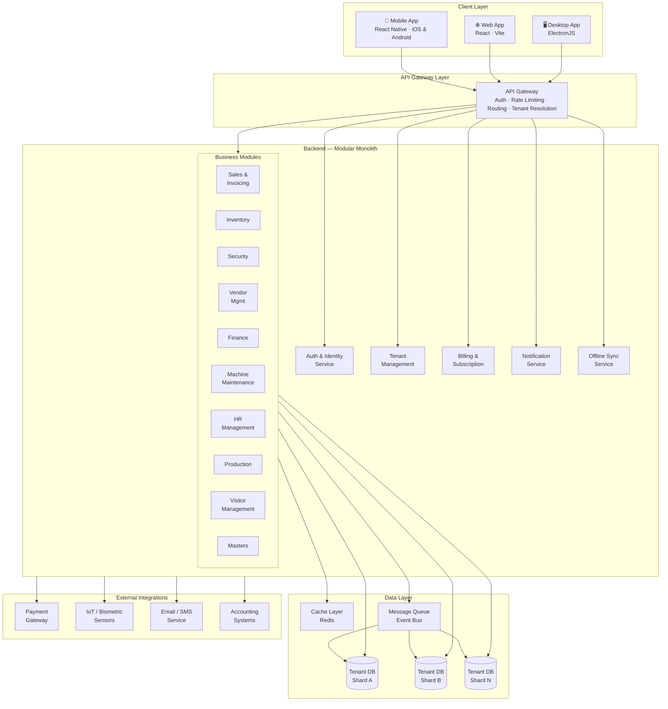

### 4.2 Backend Architecture — Modular Monolith

Avy ERP's backend follows a **Modular Monolith** architecture. This means:

- All modules live within a single deployable unit, which eliminates distributed systems complexity
- Each module has a clearly defined boundary — its own internal models, services, and controllers
- Modules communicate with each other through well-defined internal interfaces, not raw database joins
- The architecture can be decomposed into microservices in the future without rewriting business logic

This approach gives the team the **development simplicity of a monolith** with the **structural discipline of microservices** from day one.

### 4.3 Database Sharding Strategy

To support true multi-tenancy at scale, Avy ERP uses **database sharding by tenant**:

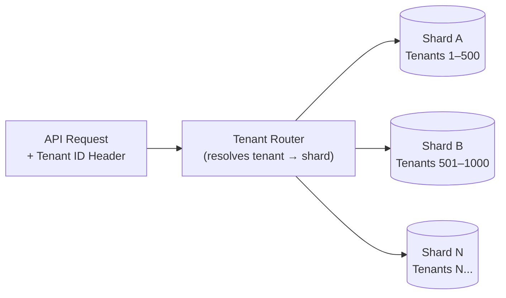

- Each tenant's data resides in an isolated database shard
- The tenant router resolves incoming requests to the correct shard using a tenant registry
- No SQL queries ever cross tenant boundaries
- Shards can be scaled, migrated, or backed up independently

---

## 4.4 Multi-Tenant Data Architecture and Tenant Isolation

Avy ERP will follow a multi-tenant SaaS architecture where multiple companies operate on the same platform while ensuring strict logical and operational isolation of their data. Each tenant (company) will have its own dedicated database schema within the platform database to guarantee strong separation between tenants while still allowing efficient system management and scalability.

When a new company signs up or is created by the Super-Admin, the system will automatically provision a dedicated tenant schema. This provisioning process will be fully automated and will include creating the schema, applying the required database migrations, initializing default configuration data, and associating the schema with the tenant in the platform's tenant registry.

A centralized Tenant Registry will be maintained at the platform level. This registry will store metadata about each tenant, including the tenant identifier, schema name, database location, subscription details, and operational configuration. All incoming application requests will resolve the tenant context using this registry before interacting with the database, ensuring that each request is routed to the correct tenant schema.

Within the data model, all operational tables will also maintain a tenant identifier (tenant_id) alongside the schema isolation. While schemas provide strong separation, the tenant identifier ensures additional logical isolation and supports future architectural flexibility, including cross-tenant analytics, auditing, monitoring, and data migration workflows.

The schema-per-tenant design allows Avy ERP to provide:
	•	Strong tenant isolation
	•	Simplified data management and backup per tenant
	•	Easier compliance with enterprise data separation requirements
	•	Efficient operational scaling as the number of companies increases

The system will also be designed to support future tenant migration and horizontal scaling. If a tenant grows significantly in size or workload, the platform will be capable of promoting that tenant to a dedicated database or shard without affecting other tenants. The tenant registry will maintain database location information so that tenant routing can be dynamically resolved by the application.

This architecture ensures that Avy ERP can initially operate efficiently using a shared database with schema isolation while maintaining the ability to evolve toward database sharding, tenant-level database separation, and distributed infrastructure as the platform grows.

Overall, this approach enables Avy ERP to maintain secure tenant isolation, operational scalability, and long-term architectural flexibility while supporting a growing number of companies on the platform.

---

## 5. Multi-Tenant SaaS Model

### 5.1 Tenancy Model

Each subscribing company is a **tenant**. Tenants are completely isolated from one another at every layer:

| Isolation Layer | Mechanism |
|---|---|
| **Data** | Separate database shard per tenant |
| **Configuration** | Tenant-scoped settings, masters, and roles |
| **Modules** | Only activated modules are accessible per tenant |
| **Users** | User accounts are scoped entirely within the tenant |
| **Billing** | Independent subscription and invoice per tenant |

### 5.2 Tenant Lifecycle

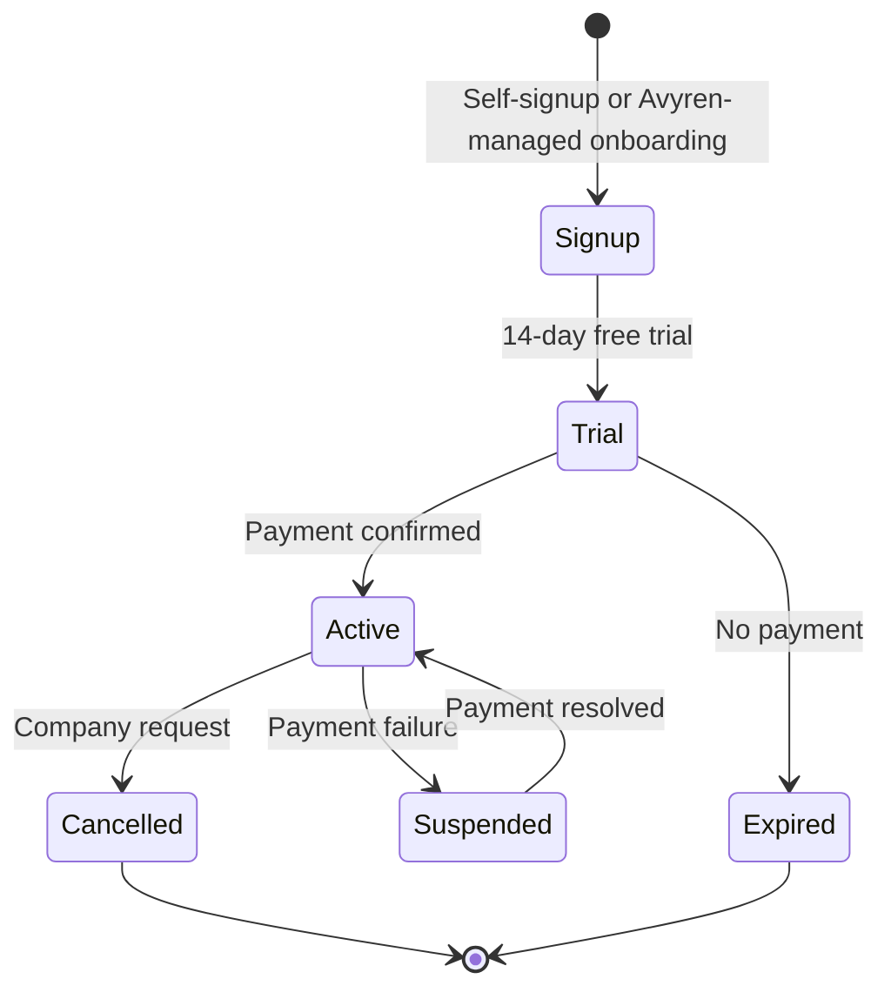

### 5.3 Multi-Plant Support

A single tenant (company) may operate from multiple physical locations or plants. Avy ERP supports a **multi-plant model** within a single tenant:

- Each company can define one or more **Plants / Locations**
- Each plant has its own GST registration (critical for India's state-wise GST system), address, and contacts
- Companies can choose between two plant configuration modes:
  - **Common Configuration** — All plants share shifts, No Series, and IOT reasons
  - **Per-Plant Configuration** — Each plant maintains independent configurations for the above
- User access and reporting can be filtered by plant
- One plant is designated as **Headquarters (HQ)** whose data reflects in the company's General Information

---

## 6. Company Onboarding

There are two pathways through which a company can become an Avy ERP tenant.

### 6.1 Option A — Self-Service Signup

Companies visit the Avyren Technologies product website and complete onboarding independently, without any intervention from the Avyren team.

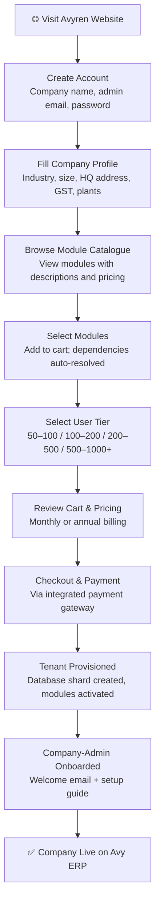

**Key self-signup behaviours:**

- Module dependency conflicts are resolved automatically at checkout — if a selected module requires another, the dependency is added to the cart and explained to the buyer
- Pricing adjusts dynamically as modules and user tiers are selected
- After payment, the tenant is provisioned within minutes with no manual intervention
- The Company-Admin account is created with full access to their tenant

### 6.2 Option B — Avyren-Managed Onboarding

For companies that are not ready to configure the system themselves, Avyren's Super-Admin can perform the full onboarding on their behalf.

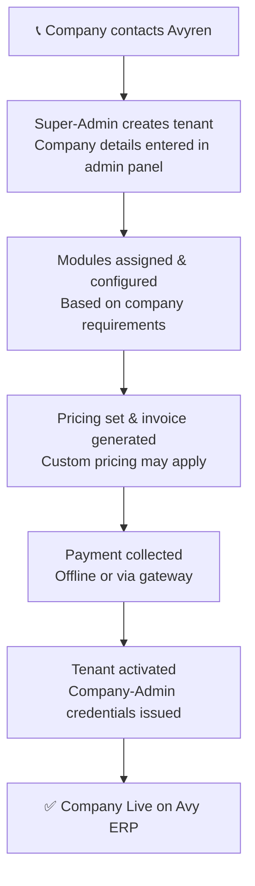

**Key managed-onboarding behaviours:**

- Super-Admin has access to a Company Master screen to create, manage, and monitor all tenants
- Super-Admin can set custom module pricing for enterprise or negotiated deals
- Super-Admin can generate and send invoices directly from the platform
- Company-Admin receives credentials and can immediately begin configuring users and roles

---

## 7. Subscription & Pricing Model

### 7.1 Pricing Dimensions

Avy ERP pricing is composed of two dimensions:

1. **Module Cost** — Each module has an individual price (monthly or annual)
2. **User Tier Cost** — Pricing is tiered by the number of active users in the tenant

### 7.2 User Tiers

| Tier | User Range | Description |
|---|---|---|
| **Starter** | 50 – 100 users | Entry tier for small factories |
| **Growth** | 101 – 200 users | Mid-sized operations |
| **Scale** | 201 – 500 users | Multi-shift, multi-line facilities |
| **Enterprise** | 501 – 1,000 users | Large manufacturing complexes |
| **Custom** | 1,000+ users | Negotiated directly with Avyren |

Each higher tier applies a slightly higher per-user rate. If a tenant's active user count crosses its subscribed tier's ceiling, additional billing applies automatically and the Company-Admin is notified.

### 7.3 Module Catalogue

All nine core modules are individually purchasable. Pricing for each module is visible in the module catalogue during signup. Some modules automatically pull in dependencies (see Section 11).

---

## 8. Role-Based Access Control (RBAC)

### 8.1 RBAC Model Overview

Avy ERP follows a **hierarchical, tenant-scoped RBAC model**. Access to every screen, data record, and action is governed by a user's assigned role.

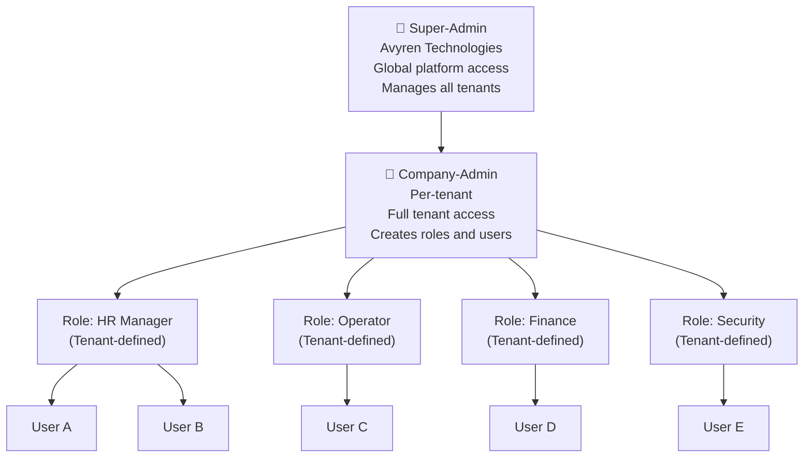

### 8.2 Primary System Roles

There are exactly **two primary roles** that exist at the platform level:

#### Super-Admin (Avyren Technologies)
- Global, cross-tenant access
- Can create, configure, suspend, and delete tenant accounts
- Can assign modules to any tenant
- Can view billing and usage data across all tenants
- Can generate and manage invoices
- Cannot access tenant business data (HR records, production data, etc.) unless explicitly granted for support purposes

#### Company-Admin (Customer)
- Full access within their own tenant only
- Can create unlimited custom roles
- Can assign specific modules and permissions to each role
- Can create and manage all users within the tenant
- Can configure tenant-wide settings (plants, shifts, No Series, etc.)
- Responsible for their own RBAC structure below this level

### 8.3 Tenant-Level Role Framework

Below the Company-Admin, the tenant may define any number of custom roles. The platform provides a reference set of common roles to accelerate onboarding:

| Reference Role | Default Access Level |
|---|---|
| General Manager | Multi-module read + dashboard |
| Plant Manager | Plant-scoped operational modules |
| HR Personnel | Full HR module |
| Finance Team | Finance module + read-only payroll |
| Production Manager | Production + Machine Maintenance |
| Maintenance Technician | Machine Maintenance module |
| Sales Executive | Sales & Invoicing module |
| Security Personnel | Security + Visitor Management |
| Stores Clerk | Inventory module |
| Quality Inspector | Production scrap/NC + reports |
| Auditor | Read-only across all modules |
| Viewer | Read-only, limited scope |

These are reference roles — the Company-Admin can modify, extend, or replace them entirely.

### 8.4 Permission Granularity

Each role can be configured at the **module level** and at the **action level** within each module:

| Action Type | Examples |
|---|---|
| **View** | Can see list and detail screens |
| **Create** | Can submit new records |
| **Edit** | Can modify existing records |
| **Delete** | Can remove records |
| **Approve** | Can approve leave, POs, etc. |
| **Export** | Can download data or reports |
| **Configure** | Can access settings and masters |

---

## 9. Feature Toggles

In addition to role-based permissions, Avy ERP supports **user-level feature toggles**. This allows fine-grained control independent of the user's assigned role.

### 9.1 Why Feature Toggles

Multiple users may share the same role (e.g., both are "Production Manager") but have different responsibilities. Feature toggles allow the Company-Admin to give User A access to payroll reporting while User B — with the same role — does not see it.

### 9.2 How It Works

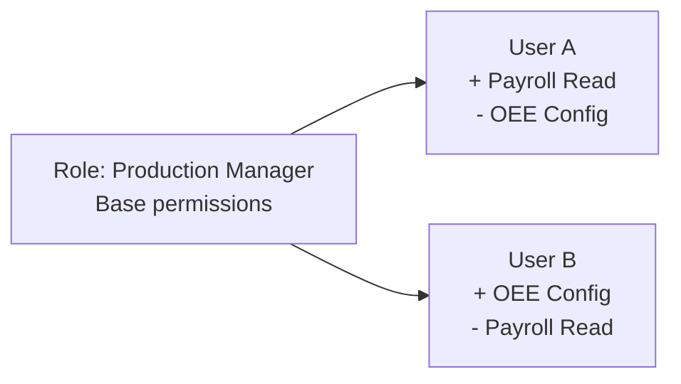

- Feature toggles are configured per-user from the User Management screen
- Toggles can override role permissions in either direction (grant additional access or restrict default access)
- The UI surface for feature toggle management is designed to be simple — a clean checklist of available features per module, shown alongside the user's current role permissions
- Changes take effect on the user's next session or within a short propagation window

---

## 10. Application Modules

Avy ERP is organised into **nine core business modules** plus a foundational Masters module, spanning the full operational spectrum of a manufacturing enterprise.

### 10.1 Module Map

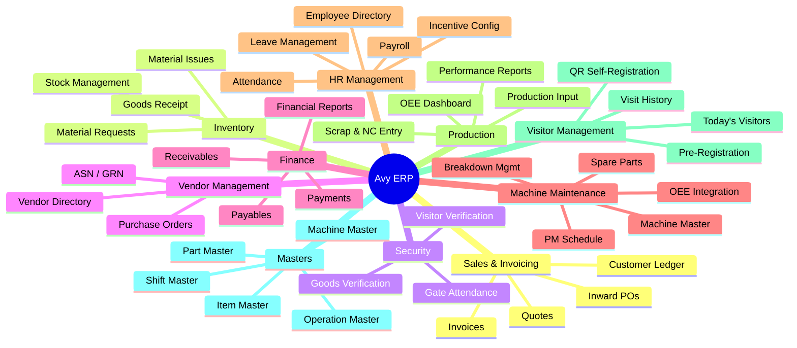

### 10.2 Module Summaries

#### Module 1 — Sales & Invoicing
Manages the complete quote-to-cash lifecycle. Supports GST-compliant invoicing with automatic CGST/SGST vs. IGST determination based on buyer location. Handles PO-referenced and general invoices, partial payment tracking, customer ledger, and a visual sales pipeline.

**Key features:** Quote creation with Item Master integration · Invoice creation (PO or General mode) · Payment-in recording with partial payment support · Customer ledger with full transaction history · Inward PO (customer PO) registration · GST auto-determination (same state → CGST+SGST / different state → IGST)

---

#### Module 2 — Inventory Management
Tracks all physical stock (raw materials, WIP, spare parts, finished goods) across multiple warehouses. Manages goods receipt, material requests and approvals, and material issues to departments.

**Key features:** Stock view with low-stock alerts (Critical / Low) · Goods Receipt via PO, ASN, or Security gate reference · Internal material request and approval workflow · Material issue tracking by department

---

#### Module 3 — Security
Gate-level operations used by security personnel at the facility entrance. This module is the source of truth for employee attendance data consumed by HR.

**Key features:** Employee attendance via manual code entry or facial recognition · Goods verification via ASN-based or manual invoice methods · Visitor gate management (expected + walk-in) · Real-time gate count per shift

---

#### Module 4 — Vendor Management
Covers the full procurement lifecycle from vendor management through purchase orders, advance shipping notices, and goods receipt.

**Key features:** Vendor directory with ratings and on-time delivery metrics · PO creation with Item Master integration · ASN creation against POs · GRN recording against ASNs · ASN verification workflow connected to Security module

---

#### Module 5 — Finance
Manages accounts receivable and payable, payment recording, and financial reporting.

**Key features:** Payables management with ageing (Current / Due Soon / Overdue) · Receivables management with reminder actions · Payment recording (inward and outward) · Financial reports: Profit & Loss, Balance Sheet, Cash Flow Statement

---

#### Module 6 — Machine Maintenance
Ensures maximum equipment uptime through preventive maintenance scheduling, rapid breakdown response, and spare parts management. Machine data from this module powers the Production OEE dashboard.

**Key features:** Machine Master (central equipment registry) · PM schedule configuration with task checklists, frequencies, and spare part requirements · Auto-generated maintenance tasks · Maintenance execution workflow (Start → Observe → Log Parts → Complete) · Breakdown reporting and resolution with live downtime counter · Spare parts inventory with reorder alerts · OEE data contribution (Availability factor from downtime)

---

#### Module 7 — HR Management
The people-operations hub of Avy ERP. Manages the full employee lifecycle from onboarding to payroll. Attendance data flows in from the Security module; incentives are driven by Production output.

**Key features:** Employee Directory (searchable by name, department, ID) · Attendance dashboard sourced automatically from Security gate scans · Configurable working-hour thresholds (Full Day / Half Day / Absent) · Leave request and approval workflow with auto-notifications · Per-employee payroll master with earnings (Basic, HRA, Conveyance, Special Allowances) and deductions (PF, ESI, TDS, Loan EMI) · Production-based tiered incentive rules linked to parts, operations, and machines

**Payroll formula:**
> Net Pay = (Earnings + Incentive) − Deductions × Attendance Factor

---

#### Module 8 — Production
Shop-floor management covering OEE monitoring, shift-wise production logging, scrap and non-conformance recording, and incentive computation.

**Key features:** Machine OEE Dashboard with Availability, Performance, and Quality indicators · Production input logging (shift, employee, part, operation, machine, quantity) · Daily / Weekly / Monthly performance summaries with incentive totals · Scrap and NC entry with rejection reasons and rework classification · OEE colour coding (Green ≥85% / Amber 60–84% / Red <60%)

**OEE Formula:**
> OEE = Availability × Performance × Quality

---

#### Module 9 — Visitor Management
Controls and records all external visitor entry to the facility — from pre-registration through gate verification to searchable audit trail.

**Key features:** Today's Visitors dashboard (real-time view with status badges: Expected / Checked In / Checked Out / Walk-In) · Pre-registration by host employees · Visit history with full audit trail (filterable by Pre-registered / Walk-in / QR Self-Registered) · QR Code self-registration (visitor scans QR at entrance, fills web form, host approves, gate is notified) — no app download required · Exportable visit logs for compliance and audit

---

#### Module 10 — Masters
Centralised configuration for all shared reference data used across modules. Masters are the single source of truth for items, shifts, machines, operations, and parts.

**Key features:** Item Master (goods, services, spare parts with HSN, GST, UOM) · Shift Master (shift timings used by attendance, production, and OEE) · Machine Master (central machine registry feeding maintenance, production, and OEE) · Operation Master (manufacturing operations referenced in production slips and incentive rules) · Part / Finished Goods Master · No Series configuration (document numbering sequences per document type)

---

### 10.3 Additional Sub-Module — Calibration Management

A specialised sub-module under Machine Maintenance for facilities that require instrument and equipment calibration compliance (ISO 9001, 21 CFR Part 11).

**Key features:** Equipment master with calibration parameters and frequencies · Auto-generated calibration schedules · Multi-point reading recording (Nominal, Actual, Error, As-Found, As-Left) · Pass / Fail / Conditional results with disposition tracking · Overdue escalation alerts (7 / 14 / 30 days) · Out-of-tolerance auto-hold / quarantine flag · Full immutable audit trail with electronic signature support · Integration with QMS and MES systems

---

## 11. Cross-Module Dependencies

Certain modules cannot operate in isolation. When a company activates a module with dependencies, those dependency modules are automatically included in the subscription.

### 11.1 Dependency Map

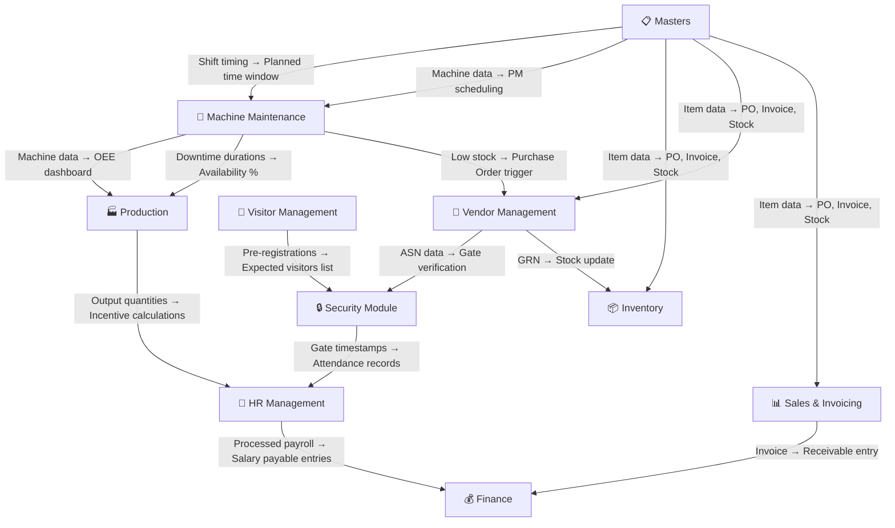

### 11.2 Dependency Rules

| Module Activated | Auto-Includes | Reason |
|---|---|---|
| **HR Management** | Security | Attendance data originates from Security gate scans |
| **Visitor Management** | Security | Gate operations and check-in/out managed by Security |
| **Machine Maintenance** | Masters | Machine Master is the central registry |
| **Production** | Machine Maintenance, Masters | OEE requires machine data; production slips reference masters |
| **Inventory** | Masters | Item Master drives all stock operations |
| **Vendor Management** | Inventory, Masters | GRN updates inventory; PO references item master |
| **Sales & Invoicing** | Finance, Masters | Invoices create receivables; line items need item master |
| **Finance** | Masters | No Series and configuration dependencies |

When a dependent module is automatically added, the Company-Admin is notified and the module cost is included in the billing estimate before checkout is completed.

---

## 12. Offline-First Design

### 12.1 Offline Scope

The mobile application is designed with an offline-first architecture, particularly important for shop-floor, industrial, and field environments where internet connectivity may be intermittent or unavailable.

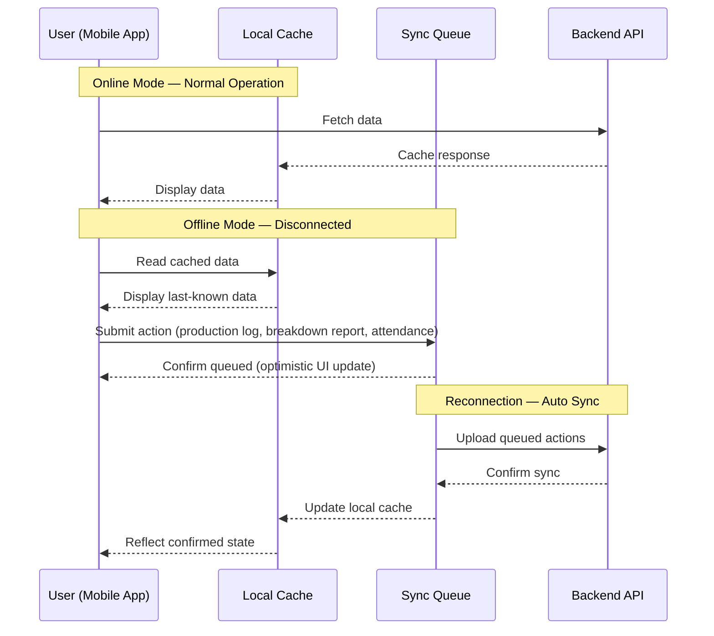

### 12.2 Offline-Capable Operations

The following operations function fully offline and sync when connectivity is restored:

| Module | Offline Operation |
|---|---|
| **Production** | Log production quantities, scrap, and NC entries |
| **Machine Maintenance** | Start/complete PM tasks, raise breakdown reports |
| **Security** | Record employee attendance at gate |
| **HR** | View employee directory and attendance history |
| **Inventory** | View stock levels (from last sync) |

### 12.3 Offline Design Rules

- The mobile app detects connectivity state and shows a clear offline indicator
- All writes in offline mode are stored in a local queue with timestamps
- On reconnection, the sync queue is processed in chronological order
- Conflict resolution follows a **last-write-wins** strategy with a server-side audit log
- Read-heavy screens (dashboards, lists) display cached data with a "last synced at" timestamp
- Operations that cannot be performed offline (invoice creation, payroll processing, payment recording) are clearly indicated as requiring connectivity

---

## 13. Analytics & Reporting

### 13.1 Dashboard Architecture

Avy ERP provides dashboards at two levels: the **Home Dashboard** (role-filtered, cross-module summary) and **Module Dashboards** (deep metrics per module).

```mermaid
flowchart LR
    subgraph Home["Home Dashboard"]
        KPI1["Today's Sales"]
        KPI2["Items in Stock"]
        KPI3["Pending Payments"]
        KPI4["Open POs"]
        CHART["Sales Trend\n(Last 7 Days)"]
        FEED["Recent Activity Feed"]
        QUICK["Quick Access Grid"]
    end

    subgraph Mod["Module Dashboards"]
        PROD["Production OEE\nAvailability · Performance · Quality"]
        HR["HR Summary\nPresent · Absent · On Leave"]
        FIN["Finance Overview\nPayables · Receivables · Cash Position"]
        MAINT["Maintenance\nPending PMs · Active Breakdowns"]
        VISIT["Visitor Activity\nExpected · Checked In · Checked Out"]
    end

    Home --> Mod
```

### 13.2 Home Dashboard — KPI Cards

The Home Dashboard is the entry point for all users. KPI cards are filtered based on the user's role, showing only the data relevant to their function.

| KPI Card | Visible To |
|---|---|
| Today's Sales | Owner, Sales Team |
| Pending Payments | Owner, Finance |
| Open Purchase Orders | Owner, Procurement |
| Items in Stock / Low Stock | Owner, Stores |
| Present / Absent Count | Owner, HR |
| Active Breakdowns | Owner, Maintenance |
| OEE Summary | Owner, Production Manager |

### 13.3 Operational Reports

| Report | Module | Description |
|---|---|---|
| Sales Report | Sales | Revenue by customer, period, product |
| Invoice Ageing | Finance | Outstanding invoices by ageing bucket |
| Payables Ageing | Finance | Vendor payments by due date status |
| Profit & Loss | Finance | Monthly/annual P&L statement |
| Balance Sheet | Finance | Assets and liabilities snapshot |
| Cash Flow Statement | Finance | Cash inflow/outflow by period |
| Attendance Report | HR | Headcount, present/absent, department-wise |
| Leave Report | HR | Leave taken by type and employee |
| Payroll Summary | HR | Salary processed, deductions, net pay |
| Incentive Report | HR / Production | Incentive payouts by employee |
| Production Summary | Production | Units produced vs target, by shift/machine/date |
| Scrap & NC Report | Production | Rejection quantities by reason and part |
| OEE Report | Production | OEE by machine, shift, and period |
| Maintenance History | Machine Maintenance | PM completion, overdue tasks, MTTR |
| Breakdown Report | Machine Maintenance | Downtime by machine, issue type, frequency |
| Visit History | Visitor Management | All visitor entries with audit trail |
| Stock Report | Inventory | Current stock levels, reorder alerts |
| GRN Report | Inventory / Vendor | Received goods with condition and discrepancies |

### 13.4 Insights Layer

Beyond standard reports, Avy ERP surfaces proactive insights:

- **Anomaly Alerts** — Unusual drops in production output, unexpected attendance spikes, or machines approaching breakdown frequency thresholds
- **Trend Indicators** — Week-on-week and month-on-month comparisons on all major KPIs
- **Overdue Escalations** — Overdue invoices, pending leave approvals, and overdue PM tasks surfaced automatically

---

## 14. Integration Strategy

Avy ERP is designed to connect with external systems, sensors, and services through a defined integration layer.

### 14.1 Integration Architecture

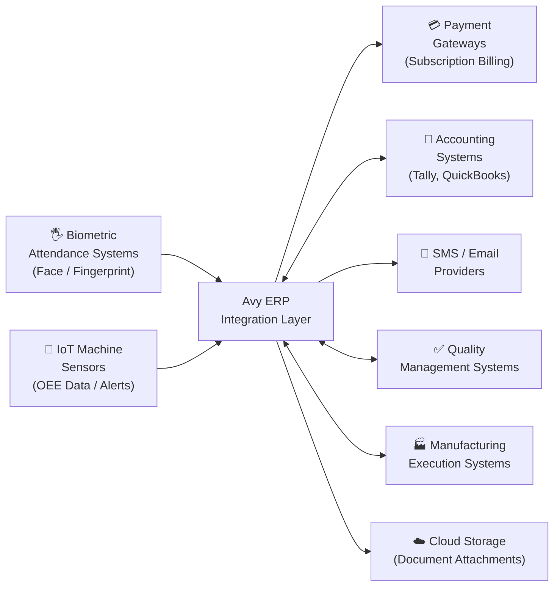

### 14.2 Integration Details

| Integration | Direction | Purpose |
|---|---|---|
| **Biometric Systems** | Inbound | Face scan / fingerprint data feeds Security module attendance |
| **IoT Machine Sensors** | Inbound | Real-time machine status, cycle times, and alerts feed OEE and breakdown modules |
| **Payment Gateways** | Outbound | SaaS subscription billing and tenant payment processing |
| **Accounting Systems** (Tally, QuickBooks) | Bidirectional | Sync payroll, payables, receivables, and journal entries |
| **SMS / Email Providers** | Outbound | Notifications for leave approvals, invoice reminders, overdue alerts, visitor check-in |
| **QMS Systems** | Bidirectional | Share calibration and quality data |
| **MES Systems** | Bidirectional | Production data exchange for facilities with existing MES |
| **Cloud Storage** | Outbound | Document attachments (invoices, POs, employee documents) |

---

## 15. Platform Interfaces

Avy ERP is delivered across three distinct platform surfaces. All surfaces connect to the same backend and reflect the same real-time data.

### 15.1 Mobile Application

The **primary operational platform** — designed for shop-floor operators, HR personnel, security staff, maintenance technicians, and sales teams who need ERP access on the go.

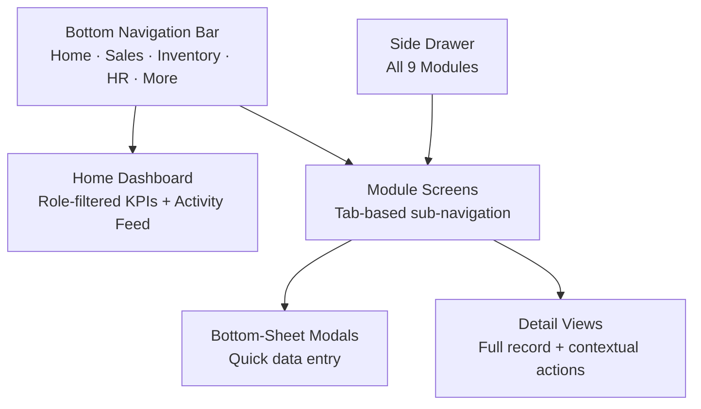

**Mobile UX principles:**
- Bottom navigation for the four most-used modules; everything else via side drawer
- Large touch targets optimised for gloved hands on the shop floor
- Offline-first — all critical operations work without connectivity
- Camera integration for face-scan attendance, QR code scanning, and document capture
- Push notifications for approvals, alerts, and reminders

### 15.2 Web Application

The **primary management and administration platform** — designed for Company-Admins, HR managers, finance teams, and operations managers who need deep data access, configuration capability, and multi-screen workflows.

**Web-specific capabilities:**
- Full Company Master configuration (plants, shifts, No Series, IOT Reasons)
- User management and RBAC configuration
- Full financial report generation and export
- Payroll processing and export
- Advanced filtering, sorting, and bulk operations across all modules
- Document download and export (PDFs, Excel)
- Super-Admin panel for tenant management (Avyren staff only)

### 15.3 Desktop Application (ElectronJS)

The **installed desktop client** — built on the web application codebase and packaged via ElectronJS for Windows and macOS. Designed for environments that need an installed application rather than a browser, or where system-level integrations are required (e.g., biometric device drivers, local printing).

**Desktop-specific capabilities:**
- Works in environments with restricted browser access
- Native system notifications
- Tighter integration with local hardware (biometric devices, receipt printers, label printers)
- Offline capability equivalent to the mobile application
- Auto-update via the ElectronJS update mechanism

---

## 16. Technology Stack

### 16.1 Mobile Application

| Layer | Technology |
|---|---|
| **Framework** | React Native with Expo |
| **Language** | TypeScript |
| **State Management** | Zustand |
| **Styling** | Nativewind (Tailwind for React Native) |
| **Data Fetching & Caching** | TanStack Query |
| **Platforms** | iOS and Android |
| **Offline Storage** | SQLite (via Expo SQLite) |
| **Sync** | Custom sync queue with TanStack Query background sync |

### 16.2 Web Application

| Layer | Technology |
|---|---|
| **Framework** | React |
| **Build Tool** | Vite |
| **Language** | TypeScript |
| **State Management** | Zustand |
| **Data Fetching** | TanStack Query |
| **Styling** | Tailwind CSS |

### 16.3 Desktop Application

| Layer | Technology |
|---|---|
| **Shell** | ElectronJS |
| **UI** | React + Vite (shared web app codebase) |
| **Language** | TypeScript |
| **Packaging** | Electron Forge |
| **Updates** | Electron auto-updater |

### 16.4 Backend

| Layer | Technology |
|---|---|
| **Runtime** | Node.js |
| **Framework** | Express.js |
| **Language** | TypeScript |
| **Architecture** | Modular Monolith |
| **Database** | PostgreSQL (sharded per tenant) |
| **Cache** | Redis |
| **Message Queue** | Event Bus (for async cross-module communication) |
| **Authentication** | JWT + Refresh Token with tenant-scoped claims |
| **File Storage** | Cloud object storage (S3-compatible) |

### 16.5 Technology Architecture Diagram

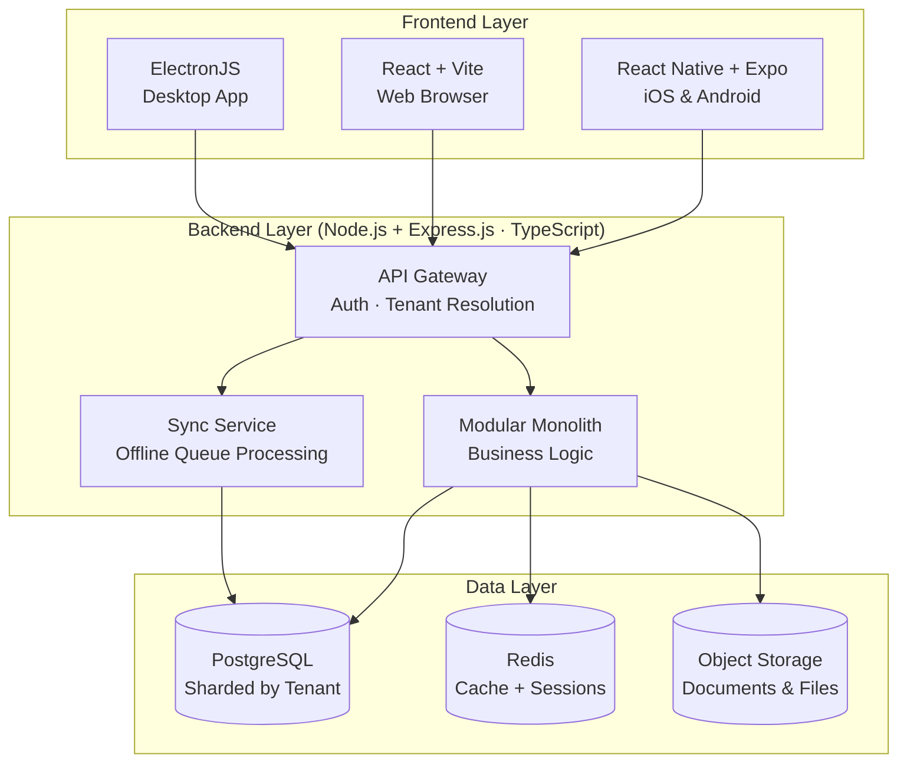

---

## 17. Non-Functional Requirements

### 17.1 Performance

| Requirement | Target |
|---|---|
| API response time (95th percentile) | < 300ms |
| Dashboard load time (cold) | < 2 seconds |
| Mobile screen transition | < 200ms |
| Offline queue sync (on reconnect) | Within 30 seconds |
| Report generation (standard) | < 5 seconds |

### 17.2 Availability & Reliability

| Requirement | Target |
|---|---|
| Platform uptime | 99.9% (excluding planned maintenance) |
| Data backup frequency | Daily automated backups |
| Recovery Point Objective (RPO) | 24 hours |
| Recovery Time Objective (RTO) | 4 hours |

### 17.3 Security

- All data in transit encrypted via TLS 1.3
- All data at rest encrypted at the database and storage layer
- JWT tokens are tenant-scoped — a token from Tenant A cannot access Tenant B
- Session expiry with configurable idle timeout per tenant
- Password policies configurable by Company-Admin
- Full audit log for all create, update, and delete operations (who, what, when)
- RBAC enforced at the API layer — not just the UI

### 17.4 Scalability

- Horizontal scaling of the backend via load balancing
- Database shards can be added as tenant volume grows
- Tenant provisioning is automated and takes under 5 minutes
- The system supports thousands of concurrent tenants

### 17.5 Accessibility & Localisation

- Mobile app supports both portrait and landscape orientations
- Web app is responsive from 1280px to 4K displays
- Date, currency, and number formats configurable per tenant locale
- GST computation built for Indian tax structure; extensible to other tax regimes
- Multi-language support planned for Phase 2 (initially English)

---

## 18. Glossary

| Term | Definition |
|---|---|
| **Avy ERP** | The Avyren Technologies enterprise resource planning platform |
| **Tenant** | A subscribing company with its own isolated environment within Avy ERP |
| **Super-Admin** | Avyren Technologies platform administrator with cross-tenant access |
| **Company-Admin** | The primary administrator of a tenant, managed by the customer company |
| **RBAC** | Role-Based Access Control — governing what each user can see and do |
| **Feature Toggle** | A user-level override that grants or restricts access independent of role |
| **Module** | A self-contained functional area of the ERP (e.g., HR, Inventory) |
| **OEE** | Overall Equipment Effectiveness — Availability × Performance × Quality |
| **PM** | Preventive Maintenance — scheduled equipment maintenance |
| **GRN** | Goods Receipt Note — records inward goods against an ASN |
| **ASN** | Advance Shipping Notice — sent by vendor before goods dispatch |
| **PO** | Purchase Order — raised by the company to a vendor |
| **GST** | Goods and Services Tax (India) |
| **IGST** | Integrated GST — applied on inter-state transactions |
| **CGST/SGST** | Central and State GST — applied on intra-state transactions |
| **HSN** | Harmonised System of Nomenclature — product classification for GST |
| **HRA** | House Rent Allowance — a salary component |
| **PF** | Provident Fund — statutory employee savings deduction |
| **ESI** | Employee State Insurance — statutory health deduction |
| **TDS** | Tax Deducted at Source — income tax withholding |
| **NC** | Non-Conformance — production output that fails quality standards |
| **Shard** | A partitioned database instance dedicated to a subset of tenants |
| **Modular Monolith** | A single-deployable backend with clearly separated internal modules |
| **Offline Queue** | Local storage for operations performed without connectivity, synced on reconnection |
| **No Series** | Document number sequences (e.g., INV-2026-0001) configured per document type |
| **Plant** | A physical location or facility within a company |
| **HQ** | Headquarters — the primary plant whose data reflects in company-level records |

---

*This document is the Master PRD for Avy ERP. Individual module Sub-PRDs will be authored separately for each of the nine core modules, containing detailed screen specifications, data models, business rules, and edge cases.*

---

**Document Control**

| Field | Value |
|---|---|
| Product | Avy ERP |
| Company | Avyren Technologies |
| Version | 1.0 |
| Date | March 2026 |
| Status | Draft |
| Classification | Confidential — Internal Use Only |
